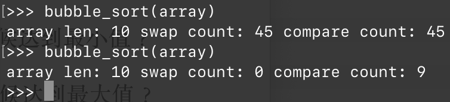

# Lecture 1 Homework

## 1.5

### Question

将算法 SELECTION_SORT 修改成如下所示的算法 MOD_SELECTION_SORT。

```pseudocode
comment: MOD SELECTION SORT
for i <- 1 to n <- 1
	for j <- i + 1 to n
		if A[j] < A[i] then SWAP(A[i], A[j])
	end for
end for
```

a) 算法 MOD_SELECTION_SORT 执行的元素赋值的最少次数是多少？什么时候达到最小值？

b) 算法 MOD_SELECTION_SORT 执行的元素赋值的最多次数是多少？什么时候达到最大值？

> 注意，每次交换花费三次元素赋值。

### Answer

a) 最少次数当然是 0 次；在数组已经有序的情况下，不会进行任何交换。

b) 最多次数，很自然地能想到是在数组倒序的情况下，需要进行的交换次数最多，在第 $i$ 层循环中需要做 $i - 1$ 次交换，因此交换次数是 $\dfrac {n(n - 1)} 2$，赋值次数 $\times 3$ 即可。

## 1.9

### Question

算法 INSERTION_SORT 和算法 SELECTION_SORT 相比，哪一个算法更有效？如果输入由大量元素组成又怎样？给出解释。

### Answer

虽然插入排序和选择排序的时间复杂度都是 $O(n^2)$ 级别的，但是有效性还是有区别。

选择排序的策略是，自左向右地找出每个位置该放的元素，并将其交换到给定位置；因此最坏情况下只需要进行 $n - 1$ 次交换，也就是 $3(n - 1)$ 次赋值。

然而插入排序的策略是每次将第 $i$ 个元素插入到已排序的 $i - 1$ 个元素的数组里。最坏情况下，每次都需要完全移动已有的 $i - 1$ 个元素。最坏情况下需要 $\dfrac {n(n-1)} 2 + n - 1$ 次赋值。

在数组较大的情况下，插入排序赋值的时间开销会远远大于选择排序的开销。

> 当然如果原始数组是用链表形式存储的，那么插入节点的时间复杂度无论在何处都是 $O(1)$ 级别。

## 1.13

### Question

用 `true` 和 `false` 填空。

|     $f(n)$     |       $g(n)$        | $f = O(g)$ | $f = \Omega(g)$ | $f = \Theta(g)$ |
| :------------: | :-----------------: | :--------: | :-------------: | :-------------: |
|  $2n^3 + 3n$   | $100n^2+ 2n + 100$  |     ？     |       ？        |       ？        |
| $50n + \log n$ | $10n + \log \log n$ |     ？     |       ？        |       ？        |
|  $50n\log n$   |   $10n\log\log n$   |     ？     |       ？        |       ？        |
|    $\log n$    |      $\log^2n$      |     ？     |       ？        |       ？        |
|      $n!$      |        $5^n$        |     ？     |       ？        |       ？        |

### Answer

第一个条目，$2n^3 + 3n$ 跟 $100n^2+ 2n + 100$ 比阶。显然前者比后者高阶，因此应该填入 `false`、`true`、`false`。

第二个条目，$50n + \log n$ 跟 $10n + \log \log n$ 比阶。其中最高阶的表达式均为 $O(n)$ 级别，因此它们属于同阶，应该填入 `true`、`true`、`true`。

第三个条目，$50n\log n$ 跟 $10n\log\log n$ 比阶。因为 $\log n$ 比 $\log \log n$ 高阶，因此前者比后者高阶，应该填入 `false`、`true`、`false`。

第四个条目，$\log n$ 跟 $\log \log n$ 比阶。因为 $\log^2n = \log n \times \log n$，因此后者比前者高阶，应该填入 `true`、`false`、`false`。

第五个条目，$n!$ 跟 $5^n$ 比阶。因为 $n!$ 比 $C^n$ 高阶，因此填入 `false`、`true`、`false`。

## 1.16

### Question

考虑如下的排序算法，该算法称为 BUBBLE_SORT（冒泡排序）。

```pseudocode
comment: BUBBLE SORT
i <- 1, sorted <- false
while i <= n - 1 and not sorted
	sorted <- true
	for j <- n downto i + 1
		if A[j] < A[j - 1] then
			SWAP(A[j], A[j - 1])
			sorted <- false
		end if
	end for
	i <- i + 1
end while
```

a) 执行该算法，元素比较的最少次数是多少？什么时候达到最小值？

b) 执行该算法，元素比较的最多次数是多少？什么时候达到最大值？

c) 执行该算法，元素赋值的最少次数是多少？什么时候达到最小值？

d) 执行该算法，元素赋值的最多次数是多少？什么时候达到最大值？

e) 用 $O$ 符号和 $\Omega$ 符号来表示该算法的运行时间。

f) 可以用 $\Omega$ 符号来表示算法的运行时间吗？说明理由。

### Answer

先写出个 Python 版本来试试。



可以看出，对于完全倒序的数组而言，要执行 $\dfrac {n(n-1)} 2$ 次比较，以及同样数目的交换。

而对于完全顺序的数组，只需要进行 $n - 1$ 次比较，且不进行任何交换。

这就是最多和最少的情况。接下来说明原因。

这个算法的思路是：每次对靠后的 $i$ 个元素从後往前地两两比较，并且将较小的那个放到前面。这样，在一次循环过后就可以保证其中最小的元素位于最前方。

重复进行 $n - 1$ 次这样的操作，每次都将查找的数组个数减少 1。这样，小元素有序地排列在数组前侧。最后一个元素无需特殊处理。

另外，假如在某一次遍历时没有发现任何元素被交换，也就是说靠後的这块数组已经有序了，那么就没有必要再进行任何排序了，直接返回即可。

因此，最坏情况的比较次数是没有任何一次循环可以被省略；$i$ 从 $1$ 取到 $n$，每次需要进行 $i - 1$ 次元素比较。因此结果是 $\dfrac {n(n-1)} 2$ 次。

同样，最坏情况下每次比较结果都不对，都需要进行交换。

最佳情况呢？第一次遍历（比较了 $n - 1$ 次）之后就发现已经有序了，那么无需进行任何交换和后续遍历，直接退出。

因此，这个算法的时间复杂度可以表示成 $O(n^2)$，或者 $\Omega(n)$。

既然 $O$ 表记法和 $\Omega$ 表记法不一致，那么就无法用 $\Theta$ 表记法来确认其时间复杂度。

## 1.17*

### Question

找到两个单调递增函数 $f(n)$ 和 $g(n)$，使得 $f(n) \ne O(g(n))$ 且 $g(n) \ne O(f(n))$。

### Answer

也就是要找到两个单调递增函数 $f(n)$ 和 $g(n)$，使得 $\lim_{n \to +\infin} \dfrac {f(n)} {g(n)}$ 和 $\lim_{n \to +\infin} \dfrac {g(n)} {f(n)}$ 都不存在。（把极限趋于 $\infin$ 也认定为不存在吧。）

取 $f(n) = n^{n + \sin n}$，$g(n) = n^{n + \cos n}$。

那么有
$$
\lim_{n \to +\infin} \dfrac {f(n)} {g(n)} = \lim_{n \to +\infin} \dfrac {n^{n + \sin n}} {n^{n + \cos n}} = \lim_{n \to +\infin} n ^ {\sin n - \cos n} = \lim_{n \to +\infin} e^{(\sin n - \cos n)\ln n}
$$
显然此极限式不存在。同样可说明其倒置形式极限也不存在。

而 $f'(n)$、$g'(n)$ 均大于 0，即单调递增。因此满足条件。

## 1.25*

### Question

请详细解释 $O(1)$ 和 $\Theta(1)$ 的不同。

### Answer

$$
\lim _{n \to +\infin} f(n) \ne \infin \implies f(n) = O(1)
$$

$$
\lim _{n \to +\infin} {f(n)} = C \ne 0 \implies f(n) = \Theta(1)
$$

例如 $f(x) = \sin x$ 满足 $f(x) = O(1)$，但是 $f(x) \ne \Theta(1)$。

## 1.31

### Question

考虑算法 COUNT4，其输入是正整数 $n$。

```pseudocode
comment: ALGORITHM COUNT_4

count <- 0
for i <- 1 to ⎣log n⎦
	for j <- i to i + 5
		for k <- 1 to i²
            count <- count + 1
        end for
	end for
end for
```

a) `count <- count + 1` 这一行语句被执行了多少次？

b) 要表示算法的复杂性，用 $O$ 合适还是用 $\Theta$ 合适？为什么？

c) 算法的时间复杂性是？

### Answer

#### a)

首先，外层循环执行的次数是 `⎣log n⎦` 次。对每一个外层循环，中层循环执行的次数是 `5` 次、内层循环执行的次数是 `i²` 次。

因此，总共执行的次数是 $\sum_{i = 1}^{\lfloor \log n \rfloor} 5 \times i^2$ 次。

#### b)

要表示该算法的复杂性，也就是表记 $\sum_{i = 1}^{\lfloor \log n \rfloor} 5 \times i^2$，这个式子可以算出来，结果是 $\dfrac {N^3} 3 + \dfrac {N^2} 2 + \dfrac N 6$，其中 $N = \lfloor \log n \rfloor$。

因此，总的时间复杂度应该是 $O(\log^3n)$，或者说 $\Theta(\log^3n)$。

因为两种表示方法都可行，那么选择最精确的一种当然更好，即 $\Theta$ 表记法。

#### c)

时间复杂性就是 $\Theta(\log^3 n)$。

## 1.32*

### Question

考虑算法 COUNT5，他的输入是正整数 $n$。

```pseudocode
comment: ALGORITHM COUNT_5
count <- 0
for i <- 1 to n
	j <- ⎣n / 2⎦
	while j >= 1
		for k <- 1 to i
			count <- count + 1
		end for
		if j 是奇数 then j <- 0 else j <- ⎣j / 2⎦
	end while
end for
```

a) $n$ 为 $2$ 的幂时，`count <- count + 1` 这一步执行的最大次数是？

b) $n$ 为 $3$ 的幂时，`count <- count + 1` 这一步执行的最大次数是？

c) 用 $O$ 符号表记的算法时间复杂性是？

d) 用 $\Omega$ 符号表记的算法时间复杂性是？

e) $O$ 和 $\Theta$ 两个符号中，哪个更适合用来表示此算法的时间复杂性？

### Answer

#### a)

当 $n = 2^k$ 时，$j$ 取 $2^{k - 1}$。因此执行的总次数是 $\sum_{i = 1}^n k = \sum_{i = 1}^n \lfloor\log_2 n \rfloor = n \lfloor \log_2 n \rfloor$。

#### b)

只有在 $j$ 是二的幂时，`while` 循环执行的次数才最大。因此在 $n = 3^k$，同时 $j = \lfloor \dfrac {3^k} 2 \rfloor = 2^m$ 时，取到最大的循环次数。

此时循环次数是 $\sum_{i = 1}^n m_i = \sum_{i = 1}^n \log_2(3^k - 1) = n\log_2(n - 1)$。

#### c)

用 $O$ 表记的结果是 $O(n \log n)$（表出最坏情况）。

#### d)

用 $\Omega$ 表记的结果是 $\Omega(n)$（表出最好情况）。

#### e)

是 $O$。因为这个算法的复杂度介于 $\Theta(n)$ 和 $\Theta(n \log n)$ 之间，无法用 $\Theta$ 符号精确表出。 

## 1.33*

### Question

考虑算法 COUNT5，他的输入是正整数 $n$。

```pseu
comment: ALGORITHM COUNT_6
count <- 0
for i <- 1 to n
	j <- ⎣n / 3⎦
	while j >= 1
		for k <- 1 to i
			count <- count + 1
		end for
		if j 是偶数 then j <- 0 else j <- ⎣j / 3⎦
	end while
end for
```

a) $n$ 为 $2$ 的幂时，`count <- count + 1` 这一步执行的最大次数是？

b) $n$ 为 $3$ 的幂时，`count <- count + 1` 这一步执行的最大次数是？

c) 用 $O$ 符号表记的算法时间复杂性是？

d) 用 $\Omega$ 符号表记的算法时间复杂性是？

e) $O$ 和 $\Omega$ 两个符号中，哪个更适合用来表示此算法的时间复杂性？

### Answer

和 1.32 很类似。

#### a)

$n = 2^k$ 的情况下，唯有 $\lbrack \dfrac {2^k} 3 \rbrack = 3^m$ 的情况下，内层循环的循环次数才最多。此时最大次数是 $n(n + 1) \lfloor \dfrac {\log_3 n} 2 \rfloor$。

#### b)

$n = 3^k$ 的情况下，最大次数是 $n(n + 1) \dfrac {\log_3n} 2$。

#### c)

$O(n^2\log n)$。

#### d)

$\Omega(n^2)$。

#### e)

是 $O$。因为这个算法的复杂度无法用 $\Theta$ 符号精确表出。 

## 1.37

### Question

请设计一个算法，对于给定的 $x$ 值，求出下面多项式的值。
$$
a_n x^n + a_{n - 1}x^{n - 1} + \dots + a_1 x + a_0
$$
a) 要求算法的时间复杂度是 $\Omega(n^2)$；

b) 要求算法的时间复杂度是 $O(n)$。

### Answer

#### a)

方法一呢，就是硬算；对于第 $i$ 个式子，需要进行 $i$ 次乘操作，总共是 $\sum_{i = 0}^{n} i = \dfrac {n(n + 1)} 2$ 次乘法；最后还需要进行 $n - 1$ 次加法。因此总的时间复杂度就是 $\Omega(n^2)$。

#### b)

方法二呢，先用 $n$ 时间求出 $x^i$，$i$ 取 $1$ 到 $n$ 的所有结果（$n - 1$ 次乘法），然后把他们分别和 $a_i$ 做乘法（$n$ 次乘法），最后把结果相加（$n - 1$ 次加法），

因此总共是做了 $2n - 1$ 次乘法和 $n - 1$ 次加法。

或者，应用秦九韶算法，将原式改写成：
$$
a_n x^n + a_{n - 1}x^{n - 1} + \dots + a_1 x + a_0
$$
等于
$$
(a_n x^{n - 1} + a_{n - 1} x^{n - 2} + \dots + a_2 x + a1)x + a_0
$$
等于
$$
((a_n x^{n - 2} + a_{n - 1} x^{n - 3} + \dots + a_3 x + a_2)x + a_1)x + a_0
$$
一直等于到…
$$
(\dots ((a_n x + a_{n - 1})x + a_{n - 2})x + \dots + a_1)x + a_0
$$
这样，可以只用 $n$ 次加法和 $n$ 次乘法就实现计算。

上面两种算法的时间复杂度都是 $O(n)$。

代码就不写了。

