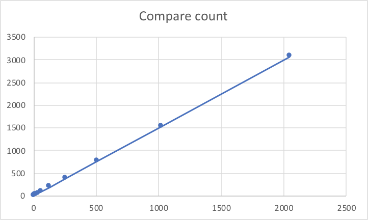
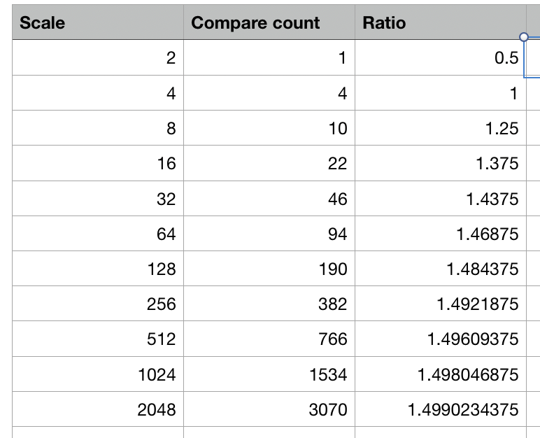
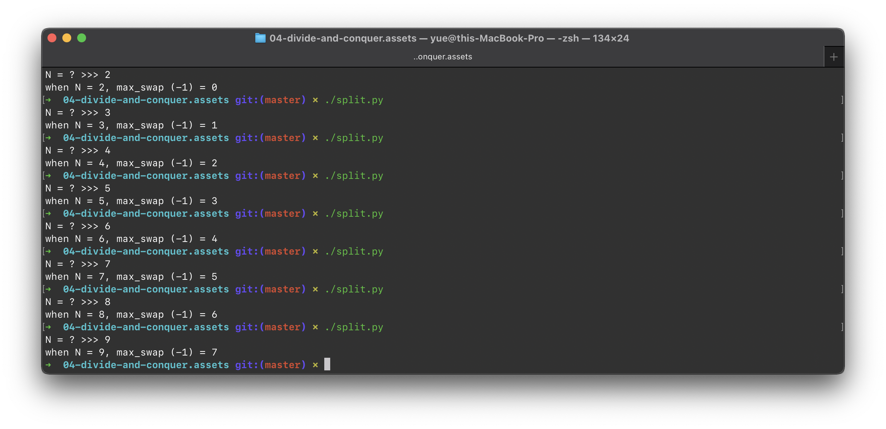

# Lecture 6 Homework

## 6.3

### Question

导出一个迭代的求最小值、最大值的算法，要求仅用 $\dfrac {3n} 2 - 2$ 次比较，在一个 $n$ 元素的集合中找出最大值和最小值。

假定 $n$ 是 $2$ 的整数次幂的形式。

### Answer

很显然，只需要 $n - 1$ 次比较就能找出最大值**或**最小值。但是这样的话一共需要 $2n - 2$ 次比较才能得到最大值**和**最小值。怎么办？

因为 $n = 2^k$，因此始终可以将问题分解为两部分。而平凡情况就是 $n = 2^1 = 2$ 的时候，这时仅仅需要一次比较就可以返回最大值和最小值。

现在考虑将两个子问题合并。左右两个数组各自包含最大值和最小值。很显然，$V_\max = \max \{ L_\max, R_\max\}$，且 $V_\min = \min\{L_\min, R_\min\}$。所以合并子问题需要 2 次比较。

很容易地写出对应的代码：

```python
#!/usr/bin/env python

def minmax(array: list) -> (int, int):
    global compare_count
    length = len(array)
    if length == 2:
        left, right = array[0], array[1]
        return (left, right) if left < right else (right, left)

    min1, max1 = minmax(array[:length // 2])
    min2, max2 = minmax(array[length // 2:])
    return min(min1, min2), max(max1, max2)
```

试着运行一下，并统计其比较次数：

```
array list, compare count: (2, 1)
array list, compare count: (4, 4)
array list, compare count: (8, 10)
array list, compare count: (16, 22)
array list, compare count: (32, 46)
array list, compare count: (64, 94)
array list, compare count: (128, 190)
array list, compare count: (256, 382)
array list, compare count: (512, 766)
array list, compare count: (1024, 1534)
array list, compare count: (2048, 3070)
```



绘图可以发现，有着很好的线性关系。而且，比例越来越接近于 $\dfrac 3 2$。



从数学角度分析，每两个元素之间都被比较了一次（最平凡的情况时）。因此带来了 $\dfrac n 2$ 次比较。

除此之外，在对 $\log_2n = k$ 层归化进行整理时，显然地有：第 $i$ 层有 $2^{i - 1}$ 个子部分，需要 $2^{i - 2}$ 次整合。而每次整合伴随着 2 次比较，所以每一层都需要 $2^{i - 1}$（$ i \ge 2$）次比较才能合并到第 $i - 1$ 层。所以总共需要进行的比较次数是 $\sum_{i = 2}^k 2^{i - 1}$ 次，即 $2^k - 2$ 次。即 $2^{\log_2 n} - 2 = n - 2$ 次。 

因此，总的求和次数是 $\dfrac 3 2 n - 2$ 次。完毕。

## 6.7

### Question

修改算法 BINARYSEARCHREC，使得它可以搜索两个关键字。换句话说，给出一个由 $n$ 个元素组成的数组 $A \lbrack 1 \dots n \rbrack$ 和两个元素 $x_1$、$x_2$，返回他们俩在数组中的索引 $k_1$ 和 $k_2$。

### Answer

BINARYSEARCHREC 是这样的：

```python
def binarysearchrec(low: int, high: int) -> int:
    global array, target
    if low > high:
        return -1
    mid = (low + high) // 2
    if target == array[mid]:
        return mid
    elif target < array[mid]:
        return binarysearchrec(low, mid - 1)
    else:
        return binarysearchrec(mid + 1, high)
```

很简单地，为了避免写成「调两次 `binarysearchrec`」，这里用了一些手段来减少没有用的递归。

简单说，如果说要求的两个 `target` 都位于同一半，那么就递归调用自己；如果两个 `target` 分立在两侧，就退化为两次 `binarysearchrec` 的调用。

```python
def __binarysearchrec(low: int, high: int, target: int) -> int:
    global array
    if low > high:
        return -1
    mid = (low + high) // 2
    if target == array[mid]:
        return mid
    elif target < array[mid]:
        return __binarysearchrec(low, mid - 1, target)
    else:
        return __binarysearchrec(mid + 1, high, target)


def binarysearchrecdup(low: int, high: int, no_left: bool = False, no_right: bool = False) -> (int, int):
    global array, target_a, target_b
    if low > high:
        return -1, -1

    mid = (low + high) // 2

    if no_left:
        return None, __binarysearchrec(low, high, target_b)
    elif no_right:
        return __binarysearchrec(low, high, target_a), None

    if target_b < mid:
        # target_a < target_b < mid
        return binarysearchrecdup(low, mid - 1)
    elif target_a < mid < target_b:
        # target_a < mid < target_b
        left, _ = binarysearchrecdup(low, mid - 1, False, True)
        _, right = binarysearchrecdup(mid + 1, high, True, False)
        return left, right
    else:
        # mid < target_a < target_b
        return binarysearchrecdup(mid + 1, high)
```

##      6.19

### Question

设 $A \lbrack 1 \dots 105 \rbrack$ 是一个已排序的、包含 $105$ 个整数的数组。假设我们运行算法 SELECT，试图找出其中第 $17$ 小的元素。对于此过程，将有多少次递归调用？

请明确解释你的答案。

### Answer

先写出一个 Python 版本的吧。

```python
#!/usr/bin/env python3

from math import ceil
from random import shuffle
from statistics import median
array = []

# kth: counting since 0
def select(array: list, low: int, high: int, kth: int) -> int:
    p = high - low + 1
    if p < 44:
        # too small? just
        return sorted(array[low: high + 1])[kth]

    q = p // 5
    groups = []

    group = []
    counter = 0
    for i in range(low, high + 1):
        group.append(array[i])
        if counter % 5 == 0:
            groups.append(group)
            group = []

        counter += 1

    midvs = [median(gp) for gp in groups]
    mm = select(midvs, 0, q - 1, ceil(q / 2))

    A1, A2, A3 = [], [], []
    for item in array[low: high + 1]:
        if item < mm:
            A1.append(item)
        elif item == mm:
            A2.append(item)
        else:
            A3.append(item)

    if len(A1) >= kth:
        return select(A1, 0, len(A1) - 1, kth)
    elif len(A1) + len(A2) > kth:
        return mm
    else:
        return select(A3, 0, len(A3) - 1, kth - len(A1) - len(A2))
```

实际运行一下，可以发现在 `k = 16`（这里 `k` 从 0 算起）递归调用了 5 次。

进行一下理论分析：首先，输入是 105 时（第一次调用），`q` 刚好为 `21`，得到的中位数数组也包含 21 个元素。之後，调用一次 `select` 获取中位数数组之中的第 `11` 大元素（第二次调用）。这时会直接通过排序并得到结果，结果是 `mm = 55`。因此原数组会被拆分成三部分；`A1`、`A2`、`A3` 分别包含 55 个、1 个、49 个元素。因为 `A1` 的长度超过了 `k`，所以会进一步对 `A1` 进行递归调用（第三次调用）。这一次，问题缩减为了 $[0, 1, \dots, 54]$。

第三次调用进入之後，由于数组长度 `55` 仍然大于 `44`，所以还要走上面的一段程序。这时候中位数的数量变少为 `11` 个，因此对中位数数组的递归调用（第四次）也是即进即出。此时得到的中位数是 `30`。换句话说，数组被分裂成 30 个、1 个、24 个数字的部分。显然 30 大于 17，因此会进行第五次递归调用，将前 30 个元素输入其中。而这一次就不再有更深的递归了；到此结束了。

> 下面是为了观察程序执行绪而打印的调试信息。

```
select call: parent init call
called with len(array): 105, low: 0, high: 104
select call: to midvs
called with len(array): 21, low: 0, high: 20
mm is 55
select call: len(A1) >= kth
called with len(array): 55, low: 0, high: 54
select call: to midvs
called with len(array): 11, low: 0, high: 10
mm is 30
select call: len(A1) >= kth
called with len(array): 30, low: 0, high: 29
16
rec times: 5
```

## 6.27

### Question

设 $A \lbrack 1 \dots n \rbrack$ 和 $B \lbrack 1 \dots n \rbrack$ 是两个已按升序排列的整数数组，且其中所有整数都互不相同。请给出一个有效的算法找出这 $2n$ 个元素的中项。

你的算法运行时间是多少？

### Answer

如果还不清楚可以给点提示：这里要求的「有效算法」的时间复杂度应该是 $O(\log n)$。

对于这个例子中的、偶数个数的中位数问题来说，有一半的元素小于中位数，且有一半的元素大于中位数。

很显然地，有：从一个数组中除去一个小于中位数的数和一个大于中位数的数，中位数不变（引论）。

那么我们就根据这个来解题。

首先，由于原数组有序，所以我们可以用 $O(1)$ 的代价获知其中位数。记之为 `A_med`、`B_med`。

* 如果 `A_med = B_med`
	* 太好了！这时候可以直接确认「有一半的数字小于她」、「有一半的数字大于她」。这就是中位数。
* 如果 `A_med < B_med`
	* 中位数一定出现在 `A` 的後半部分和 `B` 的前半部分的组合之中。
	* 否则，如果中位数出现在 `A` 的前半部分，那么可以确认有超过半数（`A` 的後一大半和 `B` 的後一半）数都大于她。他不会是中位数。位于 `B` 前半的讨论同理。
	* 因此，再根据引论，可以去除 `A` 的前半部分数和 `B` 的後半部分数，因为他们分别都小于、大于中位数，因此可以保持中位数的不变。
* 如果 `A_med > B_med`
	* 跟上面一样；只不过需要抛弃 `A` 的後半部分和 `B` 的前半部分。

综上，每次 $O(1)$ 耗时的迭代能将问题规模缩小一半。

这不就是 $O(\log n)$ 的算法嘛。

## 6.32

### Question

对于算法 SPLIT，当输入为 $A \lbrack 1 \dots n \rbrack$、且不考虑 $A_\mathrm{low}$ 和 $A_i$ 交换耗费时，执行的元素交换次数记为 $f(n)$。

#### a)

对于什么样的输入数组，$f(n) = 0$？

#### b)

$f(n)$ 的最大值是？何时取到？

### Answer

首先考察一下 Python 版本的实现。

```python
def split(low: int, high: int):
    global array
    i = low
	# choose the first element as separator
    x = array[low]

    for j in range(low + 1, high + 1):
        if array[j] <= x:
            i += 1
            if i != j:
                array[i], array[j] = array[j], array[i]

    array[low], array[i] = array[i], array[low]
```

很显然地，除去最後一行交换 $A_\mathrm{low}$ 和 $A_i$ 以外，如果 `array[j] > x` 永远真，那么就不会进行任何交换。也就是说，如果最小元素恰好就在数组头部出现，那么不会有任何交换，即 $f(n) = 0$。

最大值？利用之前写的 Perm 算法，先暴力看一看对于每个 $n$，最坏情况下的交换次数。



可以看出，实际上最坏情况下的 $f(n) = n - 2$。为什么呢？来看看最坏情况下的数组排列情况：

对于 $n = 5$，最坏情况包括：

```python
[(4, 5, 3, 1, 2), 
 (4, 5, 3, 2, 1), 
 (4, 5, 1, 3, 2),
 (4, 5, 1, 2, 3), 
 (4, 5, 2, 1, 3), 
 (4, 5, 2, 3, 1)]
```

显然，就是【次大元素、最大元素、其余元素】这样的排列方式。有 $(n - 2)!$ 种排列方式对应最坏情况。

为什么呢？首先，既然次大元素被作为 Pivot，那么就是说【次大元素、最大元素】会被放到结果数组的末尾去。观察这个 SPLIT 算法所做的优化；先遍历一次；假如遇到了一个小于 Pivot 元素的元素，并不是着急地把它跟 Pivot 交换，而是先预估着 Pivot 元素之後会放置的位置（+1、+1）；假如这个位置刚好就是 Pivot 待会会来的位置，那么就没有必要现在交换了，因为最後他们总归会被交换的；假如待会 Pivot 再往前走，那这个交换就白费了；所以不要着急交换。

而这里呢，能否应用这种法则呢？可以观察到，因为【次大元素後的最大元素】的出现，导致 `if i != j` 始终为假（因为错开了一位），所以不得不在後续每次遇到较小元素的时候都进行一次交换。而「较小元素的个数」是 $n - 2$……这就解释了为什么 $F(n) = n - 2$。

## 6.52

### Question

给出一个分治算法，在一个具有 $n$ 个数的数组中找出第二大的元素。

请一并给出算法的时间复杂性分析。

### Answer

我先给个非分治算法吧？

```python
def secondgreatest(array: list) -> int:
    greatest = None
    second_greatest = None

    for num in array:
        if greatest == None:
            greatest = num
        elif num > greatest:
            # resign
            second_greatest = greatest
            greatest = num
        elif second_greatest == None:
            second_greatest = num
        elif num > second_greatest:
            second_greatest = num

    return second_greatest
```

这个算法的时间复杂度是 $O(n)$。最坏的情况是每次都刷新第二高纪录，也就是形如

```python
[100, 1, 2, 3, 4, 5, 6, 7, 8, ...]
```

这样的数据。

总归，因为数字之间不存在内在联系，因此不可能有好于 $O(n)$ 的算法。

> 但比我这个垃圾算法快常数倍是完全可以的。

如果真的想用递归写，就用 SELECT 算法好了。