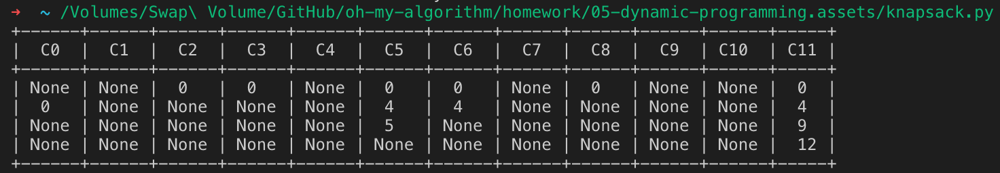
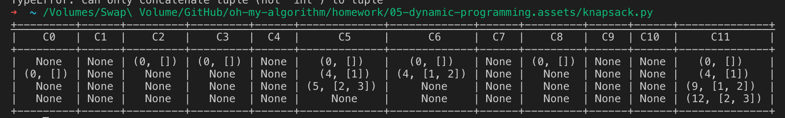

# Lecture 7 Homework

## 7.7

### Question

请说明如何修改算法 LCS，使她仅需要 $\Theta(\min\{m, n\})$ 的空间。

### Answer

首先分析目前的 LCS 算法——它采用一张 $m \times n$ 的 DP 表来记录 `M[:m]` 和 `N[:n]` 的 LCS。此时的空间占用是 $\Theta(m \times n)$ 的。把他们全部保留是必要的吗？

考虑到每一次迭代，我们所访问的是（只可能是！）左上角、直上、直左的三个格子。又因为 LCS 的填表机制始终是从左上到右下、绝不会倒行逆施，因此一旦我们抵达了第 $n$ 行，就可以安全地删除第 $n - 1$ 行之前的所有行。同理，我们也可以只保留最近 2 列。

通过 $m$ 和 $n$ 的大小关系来决定「删行」还是「删列」，可以使得最终的空间开销是 $2 \times \min \{m, n\}$ 单位。也就是题目所要求的 $\Theta(\min\{m, n\})$。

## 7.9

### Question

考虑用算法 MATCHAIN 把下面五个矩阵相乘。

* $M_1: 4 \times 5$
* $M_2: 5 \times 3$
* $M_3: 3 \times 6$
* $M_4: 6 \times 4$
* $M_5: 4 \times 5$

假设为了计算 $M_1 \times M_2 \times M_3 \times M_4 \times M_5$ 的中间结果如下表所示。$C[i, j]$ 代表执行乘法 $M_i \times \dots \times M_j (1 \le i \le j \le 5)$ 所需要的数乘的最少次数。表中还给出了最优情况下的括号结合方式。

求 $C[1, 5]$ 以及执行乘法 $M_1 \times M_2 \times M_3 \times M_4 \times M_5$ 的最优括号结合方式。

| $C[1, 1] = 0$、$M_1$ | $C[1, 2] = 60$、$M_1 M_2$ | $C[1, 3] = 132$、$(M_1 M_2) M_3$ | $C[1, 4] = 180$、$(M_1 M_2)(M_3 M_4)$ |                                       |
| -------------------- | ------------------------- | -------------------------------- | ------------------------------------- | ------------------------------------- |
|                      | $C[2, 2] = 0$、$M_2$      | $C[2, 3] = 90$、$M_2 M_3$        | $C[2, 4] = 132$、$M_2 (M_3 M_4)$      | $C[2, 5] = 207$、$M_2((M_3 M_4) M_5)$ |
|                      |                           | $C[3, 3] = 0$、$M_3$             | $C[3, 4] = 72$、$M_3 M_4$             | $C[3, 5] = 132$、$(M_3 M_4) M_5$      |
|                      |                           |                                  | $C[4, 4] = 0$、$M_4$                  | $C[4, 5] = 120$、$M_4 M_5$            |
|                      |                           |                                  |                                       | $C[5, 5] = 0$、$M_5$                  |

> 这是矩阵链乘法的一个不完全表。

### Answer

最终目的是求出右上角的空缺 $C[1, 5]$。尝试其中四种切分方式：

* $C[1, 1]$ 和 $C[2, 5]$，分别是 $0$、$207$ 次；组合需要 $4 \times 5 \times 5 = 100$ 次。一共是 $307$ 次。
* $C[1, 2]$ 和 $C[3, 5]$，分别是 $60$、$132$ 次；组合需要 $4 \times 3 \times 5 = 60$ 次。一共是 $252$ 次。
* $C[1, 3]$ 和 $C[4, 5]$，分别是 $132$、$120$ 次；组合需要 $4 \times 6 \times 5 = 120$ 次。一共是 $372$ 次。
* $C[1, 4]$ 和 $C[5, 5]$，分别是 $180$、$0$ 次；组合需要 $4 \times 4 \times 5 = 80$ 次。一共是 $260$ 次。

综上，拆分成 $C[1, 2] \times C[3, 5]$ 是最优的。

即，进行这样的括号组合 $(M_1 M_2) ((M_3 M_4) M_5)$ 最佳。一共需要 $252$ 次数乘。

## 7.21

### Question

求解 0-1 背包问题。有四个以 $(w_i, v_i)$ 形式表示的物品 $(2, 3)$、$(3, 4)$、$(5, 5)$、$(6, 7)$。

背包的容量为 $11$。

### Answer

写出下面的 Python 代码：

```python
class Good:
    def __init__(self, wv: tuple):
        self.weight = wv[0]
        self.value = wv[1]


goods = [Good(g) for g in [(2, 3), (3, 4), (5, 5), (6, 7)]]

good_count = len(goods)
knapsack_capacity = 11

dp = [[None] * (knapsack_capacity + 1) for _ in range(good_count)]


def solve_knapsack(good_index, available_capacity) -> int:
    global dp

    if dp[good_index][available_capacity] != None:
        return dp[good_index][available_capacity]

    if good_index == 0 or available_capacity == 0:
        dp[good_index][available_capacity] = 0
        return 0

    weight, value = goods[good_index].weight, goods[good_index].value
    if weight > available_capacity:
        # this good can't be put into knapsack anyway
        res = solve_knapsack(good_index - 1, available_capacity)
        dp[good_index][available_capacity] = res
        return res
    else:
        res = max(solve_knapsack(good_index - 1, available_capacity),
                  solve_knapsack(good_index - 1, available_capacity - weight) + value)
        dp[good_index][available_capacity] = res
        return res


max_val = solve_knapsack(good_count - 1, knapsack_capacity)
```



这是我们得到的。

简单地将其改写（将放入的元素组合也作为 DP 的一部分）可以输出放入背包中的元素：



即，将第 2、3 个元素放入背包能得到最优解。最大收益是 12。

> 可以看到，我们并没有必要把整张表填完；采用函数 + Cache 的做法，表中标记为 None 的格子都是没有被计算的（因为没有必要）。