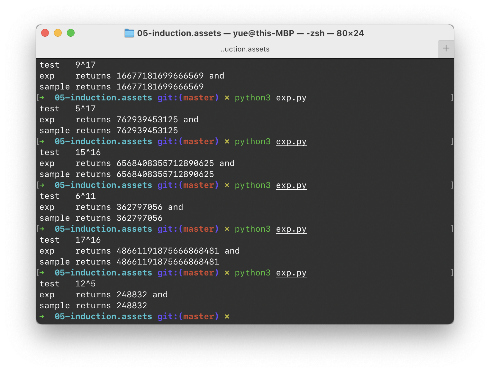

# Lecture 5 Homework 

## 5.8

### Question

当输入由下列区间中的 $n$ 个正整数组成时，以 $n$ 为大小说明算法 `RADIXSORT` 的时间复杂性。

* $\lbrack 1 \dots n \rbrack$
* $\lbrack 1 \dots n^2 \rbrack$
* $\lbrack 1 \dots 2^n \rbrack$

### Answer

也就是「桶排序」的时间复杂度问题。

对 $[1 \dots n]$ 来说，其最大数位长度大约为 $\log n$（误差小于 1）。所以「分配 $n$ 个数字到桶中」这件事需要做大约 $\log n$ 次。因此，总的时间代价是 $\Theta(n\log n)$。

同理，剩下两个的时间复杂度分别是 $\Theta(n \log n)$ 和 $\Theta(n ^2)$。

> 从数位角度来看，$[1 \dots n]$ 的位数和 $[1 \dots n^2]$ 的位数增长速率相同，只是差了一个常系数。

## 5.17 (a)

### Question

用 5.5 节中叙述的 Horner 规则求下列多项式的值。
$$
3x^5 + 2x^4 + 4x^3  + x^2 + 2x + 5
$$

### Answer

书中没有给出 $x$ 的取值，所以…只能做一做抽象计算了…
$$
3x^5 + 2x^4 + 4x^3  + x^2 + 2x + 5
$$
等于
$$
(3x^4 + 2x^3 + 4x^2  + x + 2)x + 5
$$
等于
$$
((3x^3 + 2x^2 + 4x + 1)x + 2)x + 5
$$
等于
$$
(((3x^2 + 2x + 4)x + 1)x + 2)x + 5
$$
等于
$$
((((3x + 2)x + 4)x + 1)x + 2)x + 5
$$
就是这样了。

## 5.19 (a)

### Question

用算法 `EXP` 计算下面的值：

* $2^5$
* $2^7$
* $3^5$
* $5^7$

### Answer



这个算法的思路如下：

首先，把指数 $n$ 写成二进制表示列的形式，也就是
$$
d_k \times 2^k + d_{k - 1} \times 2^{k - 1} + \dots + d_0 \times 2^0
$$
的形式。

这样，要求的 $x^n$ 就化成了
$$
x^{d_k \times 2^k + d_{k - 1} \times 2^{k - 1} + \dots + d_0 \times 2^0}
$$
根据幂指数运算法则，可以拆成
$$
x^{d_k \times 2^k} \times x^{d_{k - 1} \times 2^{k - 1}} \times \dots \times x^{d_0 \times 2^0}
$$
这样的式子就可以迭代计算了。

我们从高位到低位，也就是从左到右进行计算。

```python
def expo(base: int, exponent: int) -> int:
    binary_exp = bin(exponent)
    result = 1
    for j in binary_exp:
        result *= result
        if j == '1':
            result *= base
    return result
```

这个算法基于下面的发现：

对于任意的 $x^n$，令 $m = \lfloor \dfrac n 2 \rfloor$。如果 $n$ 是偶数，那么 $x^n = (x^m)^2$；而如果 $n$ 是奇数，那么 $x^n = x (x^m)^2$。

所以 `j == '1'` 实际上对该位的奇偶性做了判断，以此来决定进行平方之后，是否还需要乘一个额外的 `x`。

## 5.20

### Question

请详细解释，为什么在算法 `PERMUTATIONS1` 中，当 `array[j]` 和 `array[m]` 在递归调用前交换後，必须再将其交换回来。

### Answer

从 `m` 到 `m + 1` 的推导，关键在于要让新加入的那个元素在 `m + 1` 个位置都出现一次。

所以，得把他交换回来。

## 5.21

### Question

请详细结束，为什么在算法 `PERMUTATIONS2` 中，当过程 `perm2` 以 `perm2(m)`（`m > 0`）形式调用时，数组 $P$ 恰好包含 $m$ 个 0，并且这样递归调用 `perm2(m - 1)` 会刚好执行 $m$ 次。

### Answer

考虑 `n` 个数的情况。在首次调用 `perm2(n)` 时，显然恰好包含 `n` 个 `0`。

而对于 `perm2(m)` 来说，他会在递归调用 `perm2(m - 1)` 时将一个为 `0` 的位置改写为 `m`，并且在该递归退出后重写为 `0`。

这可以保证每次进入 `perm2(i)` 时，数组中都恰好有 `i` 个 `0` 项。

又由于当且仅当 `perm2()` 的调用参数为 `0` 时，循环会终止。这也就保证了递归树的深度一定就是 `n + 1`。

## 5.28

### Question

给出迭代形式的算法 `MAJORITY`。

### Answer

…这个算法，我觉得还不如 Counter 来得有效。

## 5.33

### Question

令 $A[1 \dots n]$ 是一个 $n$ 个整数的已排序的数组，$x$ 是整数。写一个 $O(n)$ 时间的算法来确定 $A$ 中是否存在两个数，他们的和恰好是 $x$。

### Answer

很自然的思路：双指针，分别指向数组首尾。

假如当前和等于目标，则宣告成功。

假如当前的和大于目标，则将尾指针向前移动。

假如小于目标，则将头指针向后移动。

假如指针重叠仍未找到结果，则宣告失败。

简单的 2-Sum 问题。