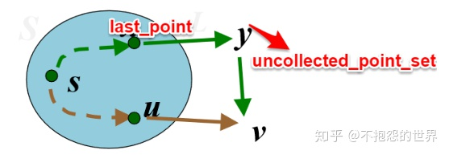

# Lecture 8 Homework

## 1

### Question

证明「单源最短路径算法」（Dijkstra 算法）的正确性。

### Answer

首先，给出一个引论：

> 贪婪算法适用的条件是：局部最优策略能产生全局最优解。

下面来看单源最短路径问题。

这个问题具有「最优子结构」性质。

> 「最优子结构」性质可以理解为，全局情况的最优解，在其任意局部也一定是最优的；不存在次优局部情况组合成了全局最优情况。

即，假如用顶点序列 $P(i, j)$ 代表从顶点 $i$ 到顶点 $j$ 的最短路径。$k$ 是这条路径中的一个点。那么，取原顶点序列的子列 $P(k, s)$ 一定也是 $k$ 到 $s$ 的最短路径。

> 很容易证明这一点。因为如果子列 $P(k, s)$ 不是最短路径，即存在另一条路径 $Q(k, s)$ 的距离短于 $P(k, s)$，那么用 $Q(k, s)$ 代入 $P(i, j)$ 就能得到一条更短的路径了；这就与 $P(i, j)$ 是最短路径矛盾。因此原「最优子结构」性质得证。

换句话说，要求 $i$ 到 $j$ 的最短距离，再任意给出一个顶点 $k$。最短路径可能经过 $k$，也可能不经过。

但「经过 $k$ 的最短路径」一定就是「$i$ 到 $k$ 的最短路径」和「$k$ 到 $j$ 的最短路径」的简单叠加。

于是，我们开始用归纳法证明。

归纳基础 `k = 1` 时显然正确；$Dist_s = 0$。

那么假设进行第 $k$ 次迭代时，Set 中的每个节点 $i$，都有 $Dist_i$ 表示 $i$ 到源点的最短路径。

那么，在第 $k + 1$ 次迭代时，我们另选了一个原来不在 Set 中的、经过集合 Set 到源点距离最近的点 $v$，将其并入集合，并设置其为 $Dist?_v$。

> 因为这里还不确定这样得到的距离是否就是最短距离；因此用 $Dist?_v$ 来表示这个算出来的临时值，而 $Dist_n$ 代表实际上的最短距离值。

> 具体实现是：找每个点直接连接的 Set 內点，用连接边权值 + 该点到源点的距离算出「过特定点的最短距离」，求最小值。
>
> 如果这个点还不直接跟 Set 相连，那么就跳过之。
>
> 这个过程称之为「松弛」。

那么这一步得到的 $Dist?_v$ 是否仍然是最短距离呢？我们先假设不是，那么就是说还存在一条「不直接进入 Set」路径，走着一条路反而更快。



换句话说，本来按照上面的算法算出来的 $v$，走 Set 內点 $u$ 是最快的。但是，是否存在另外一个点 $y$ 不在 Set 內，走 $y$ 更快呢？

用数学表示来说，就是 $Dist?_v = W_{uv} + Dist_u \gt W_{yv} + Dist_y$。

但是，考虑到 $s$ 本身是在 Set 里面的，所以 $Dist_y$（$y$ 到源点的最短路径）肯定也是要经过 Set 中点的。那么就记这条路径经过 Set 中最後一个点的名字为 `last_point`。那么式子可以进一步写成 $Dist_u + W_{uv} \gt Dist_\mathrm{last\_point} + W_{\mathrm{last\_point}, y} + W_{yv}$。

然而我们的 $v$ 是怎么找出来的？是根据「所有不在 Set 中的点，经过 Set 到源点的路径最短」的那个点找出来的。也就是说，$Dist_u + W_{uv}$ 一定比任何点经过 Set 到源点的距离要小。

也就是说，他也应该小于 $Dist_{\mathrm{last\_point}} + W_{\mathrm{last\_point}, y}$。

然而我们却说，$Dist_{\mathrm{last\_point}} + W_{\mathrm{last\_point}, y}$ 加上 $W_{yv}$ 反而要比  $Dist_u + W_{uv}$ 小。

因此，要么 $W_{yv} \lt 0$；要么 $y$ 不存在。

这个问题的前提已经说明不存在负边权。因此只能是不存在这样的 $y$；$Dist?_v$ 确实是 $v$ 到 $s$ 的最短距离 $Dist_v$。

这样，归纳法可得最後得到的一切 $Dist_i$ 都是 $i$ 到 $s$ 的最小值。

> Dijkstra 算法是正确的。

## 2

### Question

证明「最小生成树算法」的正确性。

### Answer

以 Kruskal 算法为例。

```python
T = {}

E = sort(G.E, key = lambda edge:edge:weight)

for (u, v) in E:
    if not_connected(u,v):
        T.append((u,v))

return T
```

Kruskal 算法每次会向 T 添加一条最小权重的、且不造成环的边。

而且，$n$ 个节点的最小生成树一定有 $n - 1$ 条边。

因此我们要证明其正确性，只要证明每次我们每次迭代的结果都是某一「最小生成树」（MST）的子集。

依然还是用归纳法来证明。

$n = 0$ 时，显然空集是某个 MST 的子集。

> 空集是任何集合的子集。

假设 $n = k - 1$ 时，通过这样的方法我们得到的 $k - 1$ 条边是某个 MST $T_1$ 的字集。那么，$n = k$ 时，我们往里面增加了一根不成环的最小权重边 $e$。

考虑两种情况：$e$ 是 $T_1$ 的子集。那么非常好，$n = k$ 时，生成的结果也是某个 MST 的子集——就是那个 $T_1$。

但假如 $e$ 不是 $T_1$ 的子集呢？那么我们就得证明这样得到的边集合 $E_{k}$ 是另一棵 MST 的子集。

考虑到 $e$ 不是 $T_1$ 的一条边，所以 $T_1 + \{e\}$ 一定有环。记这个环为 $C$。

> 最小生成树的性质——任意不在这棵树中的边加入这棵树，都一定构成环。

同时 $E_{k - 1} \subset T_1$，且 $E_{k - 1}$ 不成环，所以环 $C$ 上一定有至少一条边 $e'$ 不属于 $E_{k - 1}$。

现在定义 $T_2 = T_1 + \{e\} - \{e'\}$。又因为 $E_k = E_{k - 1} + \{e\}$，因此 $E_k$ 是 $T_2$ 的一个子集。

那么 $T_2$ 是不是一棵 MST 呢？首先，其中包含 $n$ 个结点。而且，其中只有 $n - 1$ 条边。因此，其中一定没有环（否则覆盖不到 $n$ 个点）。

> 从一根环上任意丢弃一条边，不会使任何点脱离。因此可以说 $T_2$ 中包含 $n$ 个结点。

另外，$e$ 和 $e'$ 都不属于 $E_{k - 1}$。但是在 $E_{k - 1}$ 往 $E_k$ 扩张时，选择了 $e$ 而不是 $e'$，这说明 $W_{e'} \ge W_e$。因此 $W_{T_2} = W_{T_1 + \{e\} - \{e'\}} \le W_{T_1}$。

由于 $T_1$ 是 MST，所以 $T_2$ 也一定是 MST。证明完毕。

> Prim 算法就不证了。一回事。

## 3

### Question

证明「Huffman 算法」的正确性。

### Answer

引理一。

给出字符集 $C$，$\forall c \in C$，有字符频率 $f(c)$。

如果存在 $x, y \in C$，有 $f(x)$、$f(y)$ 频率最小，那么存在最优二元前缀码使得 $x$、$y$ 码字等长，且仅仅在最後一位不同。

> 即，在 Huffman 二叉树上，这两个节点是兄弟。

引理二。

设 $T$ 是二元前缀码对应的二叉树。$\forall x, y \in T$，$x$、$y$ 是树叶兄弟，$z$ 是 $x$、$y$ 的父节点。那么令 $T' = T - {x, y}$，且令 $z$ 的频率 $f(z) = f(x) + f(y)$，$T'$ 是对应二元前缀码 $C - \{x, y\} \cup \{z\}$ 的二叉树。那么，$B(T) = B(T') + f(x) + f(y)$。

> 即，两个树叶兄弟（再没有子节点的一对兄弟）可以被合并成单一一个父节点，且权值不变。

现在我们要证明：Huffman 算法对任意规模 $n \ge 2$ 的字符集 $C$，都能得到关于 $C$ 最优前缀码的二叉树。

同样是数学归纳法。

归纳基础：$n = 2$ 的字符集可以得到最优前缀码。

> 那是当然的了！采 `0` 和 `1` 就是最优前缀码。

现在假设 Huffman 算法对规模为 $n = k$ 的字符集都能得到最优前缀码。

现在考虑规模为 $n = k + 1$ 的字符集。此时 $C = \{x_1, x_2, \dots, x_{k + 1}\}$。我们人为排序一下，令 $x_1$、$x_2$ 是出现频率最低的两个字符。

然后，我们把 $x_1$ 和 $x_2$ 从其中拿掉，填入一个新的字符 $z$；而且规定 $f(z) = f(x_1) + f(x_2)$。

这样，新的字符集 $C'$ 中就又只有 $k$ 个元素了。交给 $n = k$ 的情况，得到一棵树 $T$。最後，我们把 $z$ 还原为 $x_1$ 和 $x_2$ 的父节点，自己消失。这棵新树刚好包含 $k + 1$ 个字符。

下面证明这是最优的。

还是利用反证法：假设存在一棵最优二叉树 $T$ 使得 $B(T') \lt B(T)$。

那么由引理一，出现频率最低的两个字符 $x_1$ 和 $x_2$ 一定以叶子兄弟的身份出现。那么去掉 $T'$ 中的 $x_1$ 和 $x_2$，根据引理二得到的新树 $T''$ 满足 $B(T'') = B(T') - f(x_1) - f(x_2)$。由于你说 $B(T')$ 比 $B(T)$ 更优，因此 $B(T'') \lt B(T) - f(x_1) - f(x_2)$，还是等于 $B(T')$。即找出了一个 $B(T'') \lt B(T')$，和 $T'$ 是最优二叉树矛盾。因此不存在更优前缀码的二叉树，$T$ 就是最优前缀码的二叉树。

这就证明完成了。

## Summary

证明这种树、图类的算法正确性，一般都是用归纳法。从基础情况（一般很好证）开头，完成递推式（一般用到反证法），得到结果。

> 要证明一个结果不能更好，反证法当然是很适用了。

# References

* https://zhuanlan.zhihu.com/p/106394830
* https://www.jianshu.com/p/e0436c52617f
* https://www.coursera.org/lecture/algorithms/058ha-fu-man-suan-fa-de-zheng-que-xing-zheng-ming-nLQya