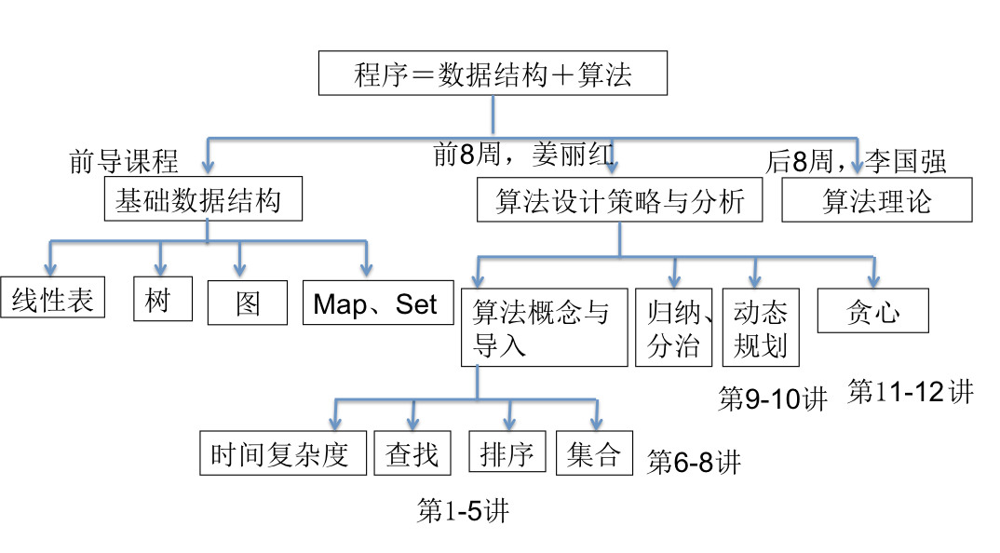
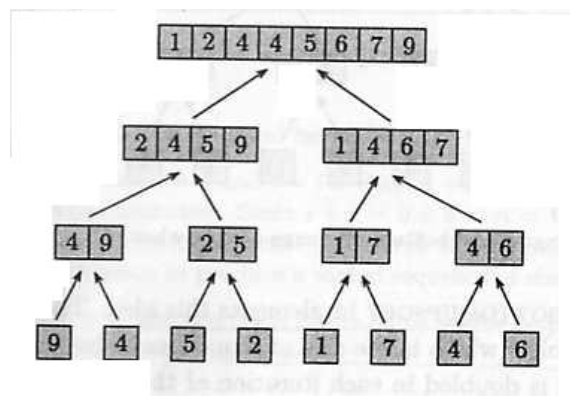

# Lecture 1

## 课本

算法设计技巧与分析，M.H.Alsuwaiyel 写的。

## 课程大纲



## 算法

### 定义

一个算法就是有穷规则的集合，其中的规则规定了一个解决某一个特定问题的运算序列。

### 特征

* 有穷性
	* 执行有穷步后结束

* 确定性
	* 每一步有确定的含义
* 能行性
	* 原则上能精确的进行，用纸和笔有限次完成
* 有输入
	* 不绝对：例如随机数生成算法就无需输入
* 有输出
	* 不绝对：例如数组原地排序算法就不会输出

### 评判标准

* 正确性
	* 最基本的
* 有效性
	* 主要指的是时间、空间的花费是否可接受
* 健壮性
* 可读性

按照算法的有效性（占用时间、空间的多少）可以讲算法分为「易性算法」和「顽性算法」。

时间、空间复杂度在对数级别、多项式级别的算法都可以称之为「易性」。但是指数级别的算法通常称之为顽性的。

## 查找算法

从一组数据之中找到符合要求的那一个。

### 顺序查找

逐个比对数组中的元素。

```python
def linear_search(array: list, target) -> int:
    index = 0
    length = len(array)
    while index < length:
        if array[index] == target:
            return index
        index += 1
    return -1
```

很显然，需要进行元素比较的次数最少需要 $1$ 次（假如目标元素位于头部），最多需要 $n$ 次（假如目标元素位于尾部或不存在）。考虑到 `target` 在列表中均匀分布，这个算法所耗费的时间是 $O(N)$ 级别的。

### 二分查找

这个算法要求输入的数组是已经排序的。

也是很简单的思路：总尽量把待查找的数组一分为二，并且通过中间元素来排除不可能包含目标元素的那一半。

下面的实现基于输入数组 `array` 已经被递增排序。

```python
def binary_search(array: list, target) -> int:
    low = 0
    high = len(array) - 1
    while low <= high:
        mid = (low + high) // 2
        if target == array[mid]:
            return mid
        elif target < array[mid]:
            high = mid - 1
        else:
            low = mid + 1
    return -1
```

元素比较的次数最少 $1$ 次（假如目标元素刚好位于正中心），最多 $\lfloor \log n \rfloor + 1$ 次。

## 合并算法

把两个已经排序好的数组合成一个，并且保证这个新数组仍然是有序的。

### 简单合并

最简单的思路就是保留两个指针，分别指向两个需要 Merge 的数组；然后从指向的元素中取出比较小的那一个填入结果。依次往後，直到触及了某个数组的结尾。

```python
def plain_merge(array_a: list, array_b: list) -> list:
    pointer_a, pointer_b = 0, 0
    length_a, length_b = len(array_a), len(array_b)

    result = []

    while pointer_a < length_a and pointer_b < length_b:
        if array_a[pointer_a] <= array_b[pointer_b]:
            result.append(array_a[pointer_a])
            pointer_a += 1
        else:
            result.append(array_b[pointer_b])
            pointer_b += 1

    if pointer_a != length_a:
        result += array_a[pointer_a:]
    elif pointer_b != length_b:
        result += array_b[pointer_b]

    return result
```

双指针，挺好写的。

复杂度分析，比较次数最少需要 $\min \lbrace A_{size}, B_{size} \rbrace$ 次；最多需要 $A_{size} + B_{size} - 1$ 次。

赋值次数肯定是 $A_{size} + B_{size}$ 次。

## 排序算法

### 选择排序

为了放入第 $i$ 个元素的位置，我们只需要找出第 $i$ 小的元素即可。

这样，我们可以从左到右开始，在我们已经把 $i - 1$ 个元素都放置到位后，就可以直接在剩下的 $n - i + 1$ 个元素中找出最小的那个（这一定就是第 $i$ 小的元素了），将其同第 $i$ 位元素交换即可。

```python
def selection_sort(array: list):
    for i in range(len(array) - 1):
        min_value = min(array[i:])
        min_index = array.index(min_value, i)

        if min_index == i:
            # already in-place
            continue
        else:
            array[i], array[min_index] = array[min_index], array[i]
```

元素比较的次数是 $\dfrac {n(n - 1)} 2$，因为每两个元素之间都要进行一次比较。

而元素的赋值次数和原始数组的情况有关；假如原始数组已经有序，则不需要任何赋值；但如果原始数组是完全反序的，则需要 $3(n - 1)$ 次赋值。

### 插入排序

这也是简单的。把前 $i$ 个元素视作有序的，然后把第 $i + 1$ 个元素放置在合适的位置，使得前 $i + 1$ 个元素都有序。这样一次排开。

> 和选择排序很类似，都是把前置的有序数组一个一个延长。不同的是选择排序每次都从后续数组中选出最小的加入排序过的数组中；而插入排序总是采取临近的那个元素。

```python
def insertion_sort(array: list):
    for i in range(2, len(array)):
        to_insert = array[i]
        if array[i - 1] <= x:
            # that's already in place. no need to do anything
            continue
        insert_point = -1
        for j in range(i - 1):
            if array[j] >= to_insert:
                # found the insert point!
                insert_point = j
                break
        if insert_point == -1:
            # to_insert value in place. no need to change anything
            continue
        else:
            # crude implementation
            # could have merely modify values between array[insert_point:i]
            # but here it modifies array[insert_point:] totally
            del array[i]
            array.insert(insert_point, to_insert)
```

这种策略对于链表型数组还比较有用；但对于普通型数组来说，赋值次数太多（大部分都是插入一个值，后面的所有元素跟着移动）。一般不会用的。

比较次数最少是 $n - 1$ 次（假如完全有序，那么跑一遍就够了）。最多则是 $\dfrac {n(n-1)} 2$ 次。

赋值的次数是「比较的次数」+ $n - 1$ 次。

### 归并排序

用图来说明更简单：



借用了上面我们用到的 Merge 算法。

```python
from plain_merge import plain_merge

# simplified implementation. not considering list copy costs.
def merge_sort(array: list) -> list:
    if len(array) <= 1:
        return array
    split_point = len(array) // 2
    left_side, right_side = array[:split_point], array[split_point:]
    return plain_merge(merge_sort(left_side), merge_sort(right_side))
```

注意，这里为了体现算法，直接把 `list` 做了拷贝处理。可以很简单地改成传递起讫索引而避免拷贝的实现。

忽略拷贝的开销，这个算法的复杂度是…？

以数组大小 $n = 2^k$ 来讨论。这样 `merge_sort` 一共被分拆了 $k = \log n$ 次；每一层都对 $n$ 个元素进行了归并，因此一共进行的归并元素个数是 $n \log n$ 个；时间复杂度自然就是 $O(n \log n)$ 啦。