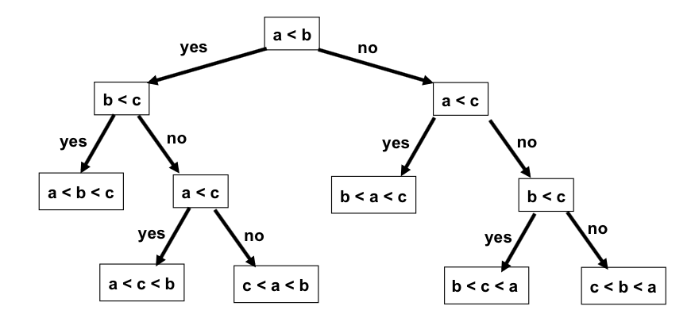
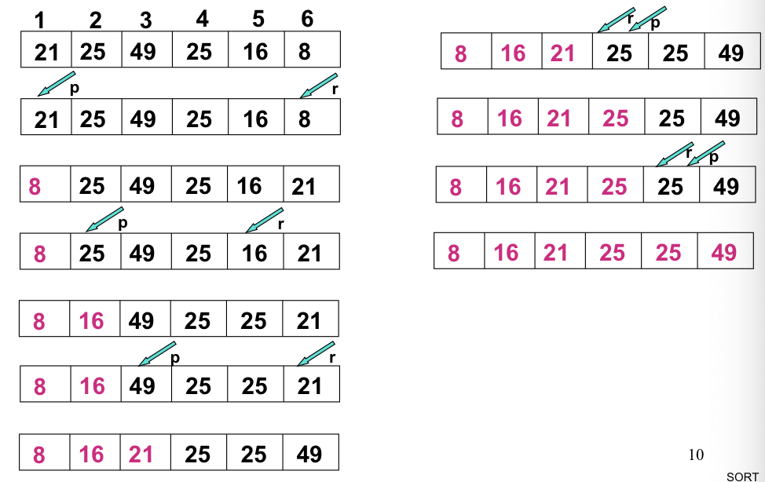
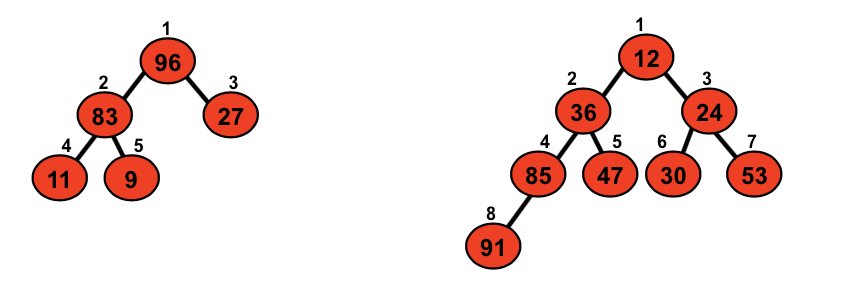
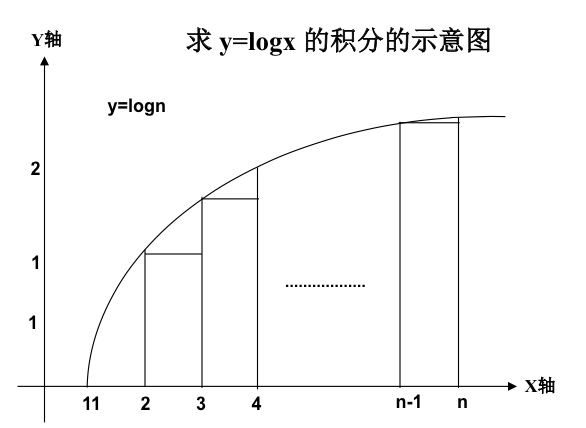
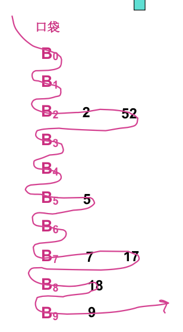

# Lecture 2

> 今天的主要话题是排序。

## 大纲

* 合并排序
* 比较法排序的时间下界
* 选择排序
* 堆排序
* 插入排序
* 希尔排序
* 快速排序
* 基数排序

## 排序概述

### 定义

给出一组序列 $\lbrace R_1, R_2, \dots, R_n\rbrace$，其对应的关键字序列是 $\lbrace K_1, K_2, \dots K_n\rbrace$。若存在一种确定的关系 $K_x \le K_y \le \dots, \le K_z$，则将原序列排成按该关键字有序的序列 $\lbrace R_x, R_y, \dots, R_z \rbrace$ 的操作，称之为排序。

这种关系是任意的，可以是数字的大于、小于，也可以是 `char` 在 ASCII 码表中的出现顺序等等。

### 稳定性

若记录序列中任意两个记录 $R_x$ 和 $R_y$ 有相同的关键字（即 $K_x = K_y$）。如果在排序前後他们的相对位置保持不变，则称这种排序方法稳定；否则称其不稳定。

## 合并排序

### 算法说明

就是 MERGE_SORT 算法。

将下属的两个已排序的表合成一张已排序表。迭代地这么做就可以了。

除了上一节中的递归式算法，我们同样可以得到一个非递归式的算法；通过记录每次被 Merge 的分块的长度来处理分块；每次将分块长度倍增。

特别处理之处是一定要保证分块的数量是偶数（否则无法进行两两 Merge）。

### 复杂性分析

这个复杂性非常好找：鉴于需要对 $n$ 个元素执行 $\log_2 n$ 次就地 Merge 操作，而 Merge 操作是 $O(n)$ 复杂度的。很显然，时间复杂度是 $O(n\log n)$。

### 理论下界

以 3 个元素的排序来考虑。理论上，3 个不同的元素会有 8 种不同的大小关系。

* 高度为 $H$ 的二叉树至多有 $2^H - 1$ 片叶子。
	* 而这棵判定树的叶子数目是 $n$ 个元素全排列的个数，即 $n!$。

* 而一棵拥有 $N$ 个节点的二叉树的高度至少为 $\lceil \log_2 N\rceil + 1$。
	* 因此这棵判定树的高度至少为 $\lceil \log_2 n! \rceil + 1$。
	* 而此式可以用 $\Theta$ 和 $\Omega$ 表记法表示为：

$\lceil \log_2 n! \rceil + 1 = \Theta(\log n!) = \Theta(\log n) \times \Theta(\log(n - 1)!) = \Theta(\log n) \times \Omega(\log_2 {2^{n-1}}) = \Omega(\log n \times (n - 1)) = \Omega(n \times \log n - \log n) = \Omega(n \times \log n)$

因此，可以看出理论上，基于比较的排序算法的下界是 $\Omega(n\log n)$。

## 选择排序

### 算法说明

在前 $i$ 个元素已经有序的情况下，从后 $n - i$ 个元素中选出最小的那个，和第 $i + 1$ 个元素做交换；这样前 $i + 1$ 个元素也都有序了。

依次进行下去，直到整个数组都有序。

### 复杂性分析

很显然，为了将第 $i$ 个元素安排到位，需要遍历 $n - i + 1$ 个元素，找出他们中的最小值索引。

但是留意到，只需要安排 $n - 1$ 个元素到位之后，第 $n$ 个元素自动到位，因此总的比较次数是
$$
\sum_{i = 1}^{n - 1} (n - i + 1) = \sum_{i = 1}^{n - 1} i = \dfrac {n(n - 1)} 2
$$
交换次数则介于 $0$ 次（完全不交换）和 $n - 1$ 次（每次都交换）之间。

因此总的时间复杂度是 $O(n^2)$。

### 改进措施

复杂度这么高的原因显然是为了取出 `array[i + 1:]` 的最大值，每次都进行遍历查询。而这个数组相对于 `array[i:]` 几乎是不变的，重复进行了很多次比较。

如果我们用堆来组织数据，就可以将每次查找最小值的时间复杂度降低到 $\log n$ 级别。这就使得整体算法的复杂度降低到了 $O(n\log n)$，即我们的理论下界。

## 堆排序

### 算法说明

跟选择排序很类似，每次总是将未排序元素中的最小值放入已排序元素的末尾。

只不过，利用「堆」这一数据结构来存储未排序元素，可以使得每次提取最小值的复杂度降低到 $O(\log n)$ 级别。

### 堆结构

给出 $n$ 个元素的序列 $\lbrace k_1, k_2, \dots, k_n \rbrace$，当且仅当以下关系满足时，此序列被称之为堆：
$$
\left\{
\begin{aligned}
k_i & \le k_{2i} \\
k_i & \le k_{2i + 1} \\
\end{aligned}
\right.
$$
或者
$$
\left\{
\begin{aligned}
k_i & \ge k_{2i} \\
k_i & \ge k_{2i + 1} \\
\end{aligned}
\right.
$$
他们分别称为最小化堆、最大化堆。

> 左图是一个最大化堆；右图是一个最小化堆。

也就是，每一个元素的值都不大于其两个子节点的值的堆称为最小化堆；反之称为最大化堆。

当然，因为这是一棵完全二叉树，因此也可以放入数组中存储。

### 排序过程

首先，我们用原来的数字构建一个堆。注意满足堆的性质并不一定意味着原数组有序。但是一定可以保证最小/最大的元素被放在了堆的顶部。

然后，我们每次从堆头部取走一个数字，并且调整堆结构使得堆的性质得以保留。最後，在堆只剩下一个元素时，数组就排序好了。

> 另有一个比较巧妙的、不需要用到额外空间的方法是：每次从堆顶取出一个元素之後，把它和堆最尾部的元素交换，并且将堆的大小减一；这样，堆的大小逐渐缩水，而尾部元素逐渐增多，直到最後取代原数组。

那么我们要解决的问题就只剩下了两个：

* 如何构建初始堆；
* 如何从堆中取走头元素，使得剩余的元素仍然构成堆。

### 堆操作

#### 构建堆

这个操作可以只用 $4n$ 次比较完成。

设树根处于第 $1$ 层，该堆共有 $h$ 层。建堆从第 $h-1$ 层开始进行。只要知道了每一层的结点数（建的小堆的个数）和每建一个小堆所需的比较次数，就可以求得建堆的时间耗费。

而第 $i$ 层小堆的个数就是第 $i$ 层节点的个数，最多不超过 $2^{i - 1}$ 个。

而第 $i$ 层小堆的高度不超过 $h - i + 1$。因此建立第 $i$ 层的小堆，所需的比较次数不超过 $2^{i - 1} \times 2 \times (h - i)$ 次。

因此，建堆的时间耗费应该是

$T(n) \le \sum_{i = h - 1}^{1} 2^i(h - i) = \sum_{j = 1}^{h - 1} j \times 2^{h - j}$，也就是 $2^h \sum_{j = 1}^{h - 1} \dfrac j {2^j}$。

留意到 $\dfrac j {2^j} \lt 2$，所以时间耗费不超过 $2^{h + 1}$。又因为 $h = \lceil \log_2 n \rceil$，因此总的时间复杂度可以表示成 $O(n)$ 级。

#### 保持堆

对于一个高度为 $h$ 的堆，移除掉其头部元素之后，要保持其有序性，即消除掉「父亲节点」比「子节点」要小的情况。

很简单：只需要从他两个子节点中找出比较小的那个，跟父节点的值交换；然后，对这个被交换的元素反复做这种「下渗」操作，直到深入根即可。

每一层要做的比较次数是 $2$ 次。交换次数可能是 $0$，也可能是 $1$。

因此，总的时间耗费应该**小于**（因为可能会有非满二叉树的情况出现）：
$$
2(\log_2 2 + \log_2 3 + \dots + \log_2(n - 1)) = 2\log_2 (n - 1)!
$$
而 $\log_2(n - 1)! \le \ln(n - 1)! = \sum_{j = 2}^{n - 1} \ln j \le \int_i^n\ln x\mathrm{d}x$，即为 $O(n\log n)$。

### 复杂度分析

自然就是构建堆和保持堆的复杂度求和。即 $O(n \log n)$。

## 插入排序

### 算法说明

大概是最不会用到的一种排序方式了…因为对于顺序数组来说，插入的代价太高了。

代码的话，去看一下 1-1 就好了。

### 复杂度分析

当数组完全是正序的时候，只需要做 $n - 1$ 次比较即可；赋值的次数是 $2(n - 1)$ 次。

当数组完全反序的时候（这就惨了！），比较次数需要提升到 $\dfrac {n(n - 1)} 2$ 次，因为还需要找出插入点；此时赋值的次数达到了 $\dfrac {n(n - 1)} 2 + n - 1$ 次。

### 优化

每一次进行插入操作的时候，我们的目的是从已排序的数组中找出一个位置来放新数字。这个操作并不需要是 $O(n)$ 的；根据二分查找的思路，完全可以用 $O(\log n)$ 时间完成。这样就节约了一些比较次数！（但是赋值次数可是一点没少）

而这就启发了下面的「希尔排序」算法。

## 希尔排序

### 算法说明

* 选定一组递减的步长序列，且终于 1；
* 对每个步长 $k$，保证所有数组中所有 $kn$（$n$ 是正整数）索引的数字构成的子列都有序。这个过程采用插入排序的思路即可；
* 因为最後的步长是 $1$，所以最後的结果一定是有序的。

### 复杂度分析

这个算法的时间复杂度对步长的选择非常敏感，最优化的步长序列很难断定。

实际操作中时间复杂性认为是 $O(n^{\frac 3 2})$（也就是说，实际的复杂性比这个更小）。

## 快速排序

### 算法说明

若序列中有 $n$ 个元素，任选一个关键字作为界点，将序列分成两部分。其中左半部分的结点的关键字小于等于界点，右半部分的结点的关键字大于等于界点。然后，对左右两部分分别进行类似的处理，直至排好序为止。

### 复杂度分析

这个算法的复杂度对于「界点」的选择非常敏感；最坏情况下（在非常倒霉的情况下）时间复杂度会坏到 $O(n^2)$；但平均情况下接近于 $O(n\log n)$；而且因为是就地排序，因此算是相当好的一个排序算法了。

## 基数排序

### 算法说明

非常神奇的、不依赖于比较的算法。

对于 $n$ 进制的数字而言，创建 $n$ 个不同的口袋，并根据其最低位的数字将其放入不同的口袋。

然后，按照这样的「蛇形」方式来收集口袋中的数字，得到的数字就是按照 $k$ 位升序排序好了。

然后，按照根据第二低位的数字再次放入口袋，这样得到的结果就按照第二低位升序排序好了。

如果输入数字的最高位数是 $k$ 位，那么这么做 $k$ 次之後，就得到结果了。

每个口袋中的数字都不定长，因此采用「双向链表」形式组织更合适。

### 复杂度分析

每次分配的代价是 $O(n)$，而每次收集的代价就是 $O(\mathrm{radix})$。

总的代价就是 $O(d \times (n + \mathrm{radix}))$。

## 作业

* 4.5
* 4.15
* 6.31
* 6.32
* 6.33
* 6.35

* 阅读 P~113~ 算法 6.5 Split。
* 将快速排序递归算法改成非递归实现。

