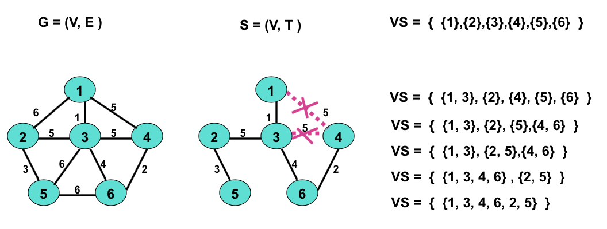

# Lecture 4

> 谈谈「并查集」的应用，以及其复杂度的详情。

## UFS 的应用：最小代价生成树

所谓的 Kruskal 最小代价生成树算法。

求无向图 `G = (V, T)` 的最小代价生成树，可以用下面的伪代码来操作：

```pseudocode
begin
T <- 𝛗
V_s <- 𝛗
foreach vertex v in V do
	add the singleton set {v} to V_s
while ||V_s|| > 1 do
	begin
		choose (v, w) as an edge in E of lowest cost
		delete (v, w) from E
		if v and w are in different sets W_1 and W_2 in V_s then
			begin
				replace W_1 and W_2 in V_s by W_1 ∪ W_2
				add (v, w) to T
			end
		end
	end
```

简单说，就是最开始把所有的节点都初始化为并查集中的单元素集合。

然后，每次都从集合中取出权重最低的一条边来 Union 这两边的集合；但如果这条边已经在某一个集合内部，那就应该放弃这条边，查找次低边，以此类推。

直到最後大家都属于同一个集合时，确认我们所 Union 的边构成的集合作为 `E`，得到我们的最小代价生成树 `(V, E)`。



## UFS 的代价

按照上节的 Weighted Tree UFS 实现方法，执行 `Union` 的代价是常数，执行 `Find(i)` 代价正比于从 `i` 上溯至根时遇到的结点个数。

对单条指令分析复杂度是做不到的；因此我们试着考虑操作代价的平均值。

具有 $C n$ 条 `Union` 和 `Find` 指令构成的序列 σ 的时间代价是多少呢？

首先，最多存在 $\log_2n - 1$ 个不同的秩组，因此对 $Cn$ 条指令中的 `Find` 来说，代价至多为 $Cn \times \log_2 n$，是 $O(n \log n)$ 级别。

而考虑到所有的 `Union` 都是常数时间级别完成，因此这一部分的耗时仅为 $O(Cn)$，即 $O(n)$ 级别。

两者加合，得到总的时间耗费是 $O(n \log n)$ 级别的。由于 $\log n$ 随 $n$ 增长缓慢，因此可以说近似于线性的。

