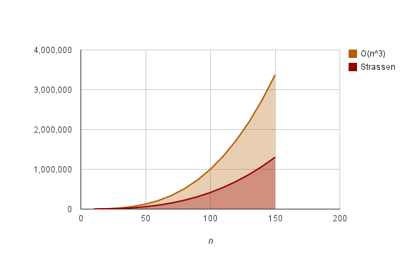
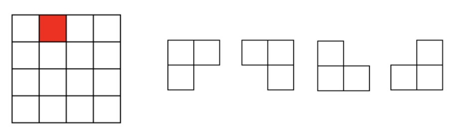
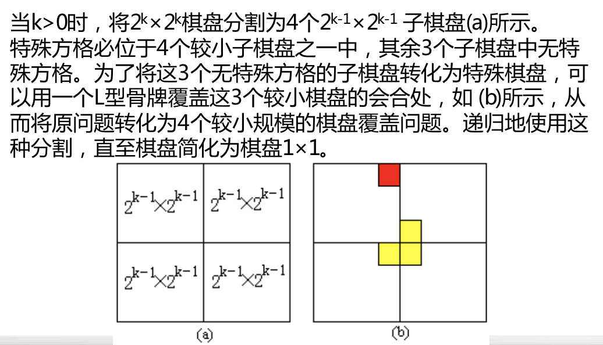

Lecture 6

> 分治策略。

## Divide & Conquer

### Intro

来看一个简单的例子。这个算法要求一个数组（长度为 n），

```pseudocode
ALGORITHM 6.1: MINMAX
x <- A[1]
y <- A[1]
for i <- 2 to n
	if A[i] < x then x <- A[i]
	if A[i] > y then y <- A[i]
end for
return (x, y)
```

伪代码不好看，用 Python 改写：

```python
def find_min_max(array: list) -> (int, int):
    # x: min, y: max
    x, y = array[0], array[0]
    n = len(array)
    for i in range(1, n):
        if array[i] < x:
            x = array[i]
        # 这里实际上可以用 elif
        # 因为如果 array[i] < x 就必不可能 > y
        if array[i] > y:
            y = array[i]
    return (x, y)
```

或者，写得更简单一点：

```python
def find_min_max_opt(array: list) -> (int, int):
    if array == []:
        return None, None
    min_v = max_v = array[0]
    for v in array[1:]:
        if v < min_v:
            min_v = v
        elif v > max_v:
            max_v = v
    return min_v, max_v
```

很容易可以看出这个算法所做的事情。

复杂度也很显然，对于一个长度为 $n$ 的数组输入，需要进行 $2(n - 1)$ 次比较，即时间复杂度是 $O(n)$。

### Optimize Attempts

对于这种「涉及到 $n$ 个互不关联数据」的算法，通常来说极限就是 $O(n)$ 了；因为至少要在每个元素上均等地耗费常数时间。

但是，极限是 $O(n)$ 并不意味着我们上面的 $2(n - 1)$ 次比较的算法就是最优的了。

如果我们采用二分策略，给出一个数组时将其拆成两部分，分别求每一部分的最大最小值，然后做一次归并，会怎样？

> 这里当然不必要真的去拆解/拼凑数组。保留一个全局数组，传递索引就好了。

```python
def find_min_max_dvq(array: list) -> (int, int):
    def __minmax(low: int, high: int) -> (int, int):
        if high - low == 1:
            low_v, high_v = array[low], array[high]
            return (low_v, high_v) if low_v < high_v else (high_v, low_v)
        else:
            mid = (low + high) // 2
            x1, y1 = __minmax(low, mid)
            x2, y2 = __minmax(mid + 1, high)
            return min(x1, x2), max(y1, y2)
    if array == []:
        return None, None
    return __minmax(0, len(array) - 1)
```

分析这个算法的复杂度，可以发现对于 $n$ 个元素的问题可以将其拆成两个大约是 $\dfrac n 2$ 个元素的小问题、加上两次比较完成，且在平凡情况下（$n = 1$ 或 $n = 2$）仅仅消耗 $1$ 次比较。

这里，总的比较次数仅仅需要 $\dfrac {3n} 2 - 2$ 次。这就是一个显著的「分治」功效：「解决小问题」多次所消耗的总时间，比起解决「问题的总和」所耗费的时间更短。

### Main Idea

* 将问题拆分成若干个小问题，分别求解；
* 将求出的小规模问题的解合并为一个更大规模问题的解；
* 自底向上逐步求出原问题的解。


### Applicable Conditions

并非所有的问题都适合使用分治法求解。

* 如果拆分後的问题都是独立的，那么较适合使用分治法。
* 如果拆分後的子问题非独立，则需要重复求解公共子问题，此时用动态规划法更合适。
* 在拆分子问题时，应该尽量使得每个子问题的规模大致相同。

> 这种思路被称为平衡（Balancing）子问题思想。利用此种思路几乎总能得到比非平衡时更好的解。

### Complexity

考虑一个一般化的分治策略算法。

* 将规模为 $n$ 的问题分拆成 $k$ 个 $\dfrac n m$ 的问题。
* 分解底线是 $n_0 = 1$（即当问题规模变为 $1$ 时退化为平凡情况，无需再进行分治）。
* 将问题分解为 $k$ 个子问题的时间、**加上**将 $k$ 个子问题的解合并成原问题的解所耗费的时间一共是 $f(n)$ 单位时间。

那么，用分治法解决规模 $|P| = n$ 的问题所耗费的时间 $T(n)$ 是：

* $O(1)$

	* 在 $n = n_0 = 1$ 时。

* $k T(\dfrac n m) + f(n)$

	* 在 $n > n_0 = 1$ 时。

		> 这里假定了 $n = m^k$。事实上，在 $n$ 很大、$T(n)$ 很平滑时，可以用这个离散的 $T(n)$ 来估计其实际增长速度。

迭代法可以求出 $T(n)$ 的解是 $n^{\log_m k} + \sum_{j = 0} ^ {\log _m {n - 1}} k^j f(\dfrac n {m^j})$。

### Example

#### Binary Search Algorithm

来看一个实际问题。

给定已按升序排好序的 $n$ 个元素，在其中中找出某一特定元素 $x$ 的索引。

##### Analytics

* 问题规模缩小到一定程度可以容易解决。
	* 这当然了，至少 $n_0 = 1$ 时可以 $O(1)$ 解决。
* 该问题可以分解为若干个规模较小的子问题。
* 分解出的各个子问题相互独立。
	* 例如，在 $A$ 的前半部分查找和後半部分查找是完全独立的子问题。
* 分解出的子问题的解可以合并为原问题的解。
	* 的确如此；只要在某个子数组中找到了一个索引，就可以作为原问题的解提出。

##### Implementation

```c++
int binarySearch(int[] a, int x, int n)
{
    int left = 0;
    int right = n - 1;

    while (left <= right)
    {
        int middle = (left + right) / 2;
        if (x == a[middle])
            return middle;
        if (x > a[middle])
            left = middle + 1;
        else
            right = middle - 1;
    }
    return -1;
}
```

每执行一次算法的 `while` 循环， 待搜索数组的大小减少一半。

因此，在最坏情况下， `while` 循环要被执行 $O(\log n)$ 次。

循环体内运算需要 $O(1)$ 时间，因此整个算法在最坏情况下的计算时间复杂性 为 $O(\log n)$。

#### Big Integer Multiplication

设计一个有效算法，进行两个 $n$ 位大整数的乘法运算。

> 假设已经提供了一个 $O(n)$ 时间复杂度的大整数加法运算。

##### Naïve Solution

按照小学的算法，也就是把其中一个大整数的每一位提出来做乘法运算，此时退化为一个 $n$ 位大整数和一个 $1$ 位数的乘法运算，可以在 $O(n)$ 时间内完成。然后，将得到的 $n$ 个数字赋予不同位（添尾 $0$），再加和。

这样总的时间复杂度是 $O(n^2)$。

当然，是非常慢的。

##### Divide & Conquer I

鉴于 $2^k$ 形式的乘法非常简单（可以在 $O(1)$ 时间内完成），因此我们尝试将两个被乘数拆分成这个样子：
$$
X = a \times 2^{\frac n 2} + b
$$

$$
Y = c \times 2^{\frac n 2} + d
$$

这样，$X \times Y$ 就可以表示成
$$
X \times Y = ac \times 2^n + (ad + bc) \times 2^{\frac n 2} + bd
$$
也就是说，把 $n$ 规模的数字乘法 $X \times Y$ 拆分成了四个（大约）$\dfrac n 2$ 规模的乘法：$a \times c$、$a \times d$、$b \times c$、以及 $b \times d$。

分析其复杂度，可以得到
$$
T(n) = 4 \times T(\dfrac n 2) + O(n)
$$
于是总时间复杂度就是 $T(n) = O(n^{\log_2 4}) = O(n^2)$。

相比于 Naïve Solution，没有本质的改进。

##### Divide & Conquer II

另有一种办法。改变我们拆分、合并问题的方法。

问题的症结在于 $ac \times 2^n + (ad + bc) \times 2^{\frac n 2} + bd$ 太难算了。但是，留意到这个式子等价于
$$
ac \times 2^n + ((a - c) \times (b - d) + ac + bd) \times 2^{\frac n 2} + bd
$$
加减所耗费的 $O(n)$ 复杂度忽略不计的话，我们可以发现这里只有三组不同的子问题了。

这样，这种解法的 $T(n) = 3 \times T(\dfrac n 2) + O(n)$，总的复杂度降低到了 $O(n^{log_2 3})$，大约是 $O(n^{1.59})$。

> 实际上，原式也可以变形成 $ac \times 2^n + ((a + c) \times (b + d) - ac - bd) \times 2^{\frac n 2} + bd$，但是这样 $(a + c) \times (b + d)$ 可能导致进位，从而导致子问题规模变大，因此不采用这种方法。

##### FFT

事实上，如果将大整数分成更多段，并用更复杂的方式将其组合，有可能得到更优化的算法。

最终，这个问题可以利用快速傅立叶变换算法（Fast Fourier Transform），在 $O(n \log n)$ 时间内完成。

#### Matrix Multiplication

计算两个 $n \times n$ 的矩阵的乘积。

##### Naïve Solution

当然，可以按照线性代数老师的方法，对结果矩阵中每个位置的元素，进行 $n$ 次乘法和 $n$ 次加法，耗费 $O(n)$ 的时间。因此总的时间复杂度就是 $O(n^3)$。

##### Divide & Conquer I

为方便讨论，令 $n = 2k$。于是，对矩阵进行 $2 \times 2$ 分块，可以得到：
$$
A = \left[
 \begin{matrix}
   A_{11} & A_{12} \\
   A_{21} & A_{22}
  \end{matrix}
  \right]
$$

$$
B = \left[
 \begin{matrix}
   B_{11} & B_{12} \\
   B_{21} & B_{22}
  \end{matrix}
  \right]
$$

$$
C = \left[
 \begin{matrix}
   C_{11} & C_{12} \\
   C_{21} & C_{22}
  \end{matrix}
  \right]
$$

因此根据
$$
\left[
 \begin{matrix}
   C_{11} & C_{12} \\
   C_{21} & C_{22}
  \end{matrix}
  \right] = \left[
 \begin{matrix}
   A_{11} & A_{12} \\
   A_{21} & A_{22}
  \end{matrix}
  \right] \times \left[
 \begin{matrix}
   B_{11} & B_{12} \\
   B_{21} & B_{22}
  \end{matrix}
  \right]
$$
和矩阵分块理论，可以得到：

* $C_{11} = A_{11} \times B_{11} + A_{12} \times B_{21}$
* $C_{12} = A_{11} \times B_{12} + A_{12} \times B_{22}$
* $C_{21} = A_{21} \times B_{11} + A_{22} \times B_{21}$
* $C_{22} = A_{21} \times B_{12} + A_{22} \times B_{22}$

因此，容易得到这种简单分块算法的时间复杂度 $T(n)$ 满足
$$
T(n) = 8 \times T(\dfrac n 2) + \Theta(n ^ 2)
$$
即，总的时间复杂度还是 $O(n^{\log_2 8})$，即 $O(n^3)$。

> 没有本质区别嘛。

##### Strassen's Algorithm

鬼才算法。

并不改变矩阵分块的方式。

上面的算法需要 $8$ 次乘法、$8$ 次加法。是否能够节约时间呢？
$$
\begin{equation}
\begin{split}
S_1 &= B_{12} - B_{22} \\
S_2 &= A_{11} + A_{12} \\
S_3 &= A_{21} + A_{22} \\
S_4 &= B_{21} - B_{11} \\
S_5 &= A_{11} + A_{22} \\
S_6 &= B_{11} + B_{22} \\
S_7 &= A_{12} - A_{22} \\
S_8 &= B_{21} + B_{22} \\
S_9 &= A_{11} - A_{21} \\
S_{10} &= B_{11} + B_{12}
\end{split}
\end{equation}
$$
算出这么怪怪的十个中间矩阵，然后
$$
\begin{equation}
\begin{split}
P_1 &= A_{11} \times S_1 \\
P_2 &= S_2 \times B_{22} \\
P_3 &= S_3 \times B_{11} \\
P_4 &= A_{22} \times S_4 \\
P_5 &= S_5 \times S_6 \\
P_6 &= S_7 \times S_8 \\
P_7 &= S_9 \times S_{10}
\end{split}
\end{equation}
$$
最後，只要这么一变化！
$$
\begin{equation}
\begin{split}
C_{11} &= P_5 + P_4 - P_2 + P_6 \\
C_{12} &= P_1 + P_2 \\
C_{21} &= P_3 + P_4 \\
C_{22} &= P_5 + P_1 - P_3 - P_7 \\
\end{split}
\end{equation}
$$
就能得到上面要求的 $C$ 矩阵了。这竟然是正确的！

仔细分析一下，发现这里只用了 $7$ 个矩阵乘法和 $18$ 个矩阵加法。在数量级 $n$ 很大的时候，这仍然能够节约时间！

总的时间复杂度是 $O(n^{\log_2 7})$，大约是 $O(n^{2.81})$。



後来，Hopcroft 和 Kerr 在 1971 年证明，对于 $2 \times 2$ 分块来说，不存在少于 $7$ 个的子问题分割。後来，大家又采用了很多奇奇怪怪的分割方法，得到了目前最优的 $O(n^{2.376})$。 

#### Chess Coverage

在一个 $2^k \times 2^k$ 棋盘中，恰有一个方格与其他方格不同，称该方格为一特殊方格，且称该棋盘为一特殊棋盘。

在棋盘覆盖问题中，要用图示的 4 种不同形态的 L 形骨牌覆盖给定的特殊棋盘上除特殊方格以外的所有方格，且任何 $2$ 个 L 形骨牌不得重叠覆盖。



要覆盖的棋盘格数 $2^{2k} - 1$ 等于 $(2^k + 1) \times (2^k - 1)$。考虑到「三个连续自然数中必有一个是 $3$ 的倍数」，因此 $2^k - 1$、$2^k$、$2^k + 1$ 中必有一个是 $3$ 的倍数。而 $2^k$ 一定不是，因此 $2^k - 1$ 和 $2^k + 1$ 之中必有一个 $3$ 的倍数。因此原棋盘格数一定是 $3$ 的倍数。

##### Intuition

看起来是个毫无头绪的办法。但是，我们可以用这种很奇妙的方式进行问题分解：



> 巧妙！

这样，就能完美地将 $2^k$ 规模的问题化为 $2^{k - 1}$ 规模的问题，且 $k = 1$ 时就已经是平凡的了（只要根据特殊格的位置填充一个 L 形骨牌即可）。

时间复杂度是 $O(\log_2{(2^k)^2})$，即 $O(4^k)$。这是渐进意义上的最优解。

