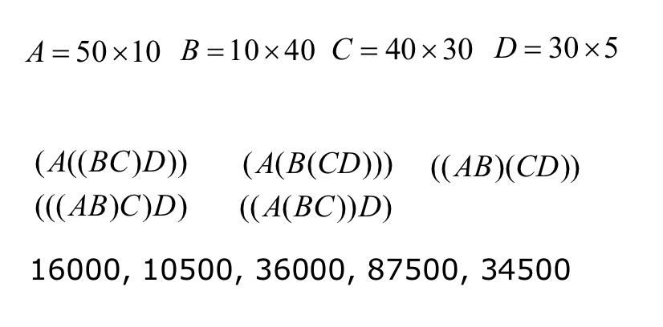
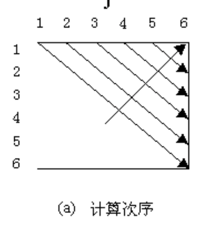

# Lecture 7

> 真的明白动态规划吗？

## Dynamic Programming

### Intro

来看一个最简单的「递归」例子：

```python
def Fibonacci(n: int) -> int:
    if n == 1 or n == 2:
        return 1
    return Fibonacci(n - 1) + Fibonacci(n - 2)
```

非常容易分析出，这个算法的时间复杂度是指数级别的。虽然他是那么的简洁、明了、又漂亮。但就是太慢了。

主要的耗时在于，从大到小的计算会带来大量的重复运算。

即，在我们算 $F(n)$ 时，会独立地计算 $F(n - 1)$ 和 $F(n - 2)$。然而实际上两者的运算基本上是重复的，平白无故花了一倍的时间。而且每个子问题的运算同样存在重复问题，这就导致时间开销进一步增大。

那么，有办法将时间复杂度缩减吗？答案是当然的。

首先，我们可以用 $O(1)$ 的代价，根据 $F(n - 1)$ 和 $F(n - 2)$ 算出 $F(n)$。由此，我们可以知道，如果我们从小到大地计算 $F(i)$，并且每一次都将上一个运算值记录在案，就能将时间复杂度缩减到 $O(n)$ 的水平。

```python
@better
#!/usr/bin/env python

def Fibonacci(n: int) -> int:
    if n < 3:
        return 1
    f_n_1 = 1
    f_n_2 = 1
    for _ in range(3, n + 1):
        f_n = f_n_1 + f_n_2
        f_n_1, f_n_2 = f_n, f_n_1
    return f_n
```

例如这里，我们只需要每次记录当前 `n` 对应的前两个值，就足够计算出 `F(n)` 了。显然这是个 $O(n)$ 时间的算法。

> 这其实不能算一个动态规划。最多算半个 Cache。

### Idea

如果能够保存已解决的子问题的答案，而在需要时再找出已求得的答案，就可以避免大量重复计算，从而（或许能）得到多项式时间算法。

像是之前的「递归」、「分治」，其实都是自顶向下的；从一个困难的问题逐渐分割、递减到一个平凡情况。在各个问题的解决之间独立的时候，或者是问题的规模下降得很快（至少要指数级别下降才能抵消递归的代价）时，这是合适的。

但如果是每个子问题之间不独立、相互依赖，那么独立的算法就不合适。

动态规划的想法是：

* 找出最优解的性质、刻画其结构特征
* 递归地定义最优值
* 自底向上地计算最优值
* 根据计算最优值得到的信息，构造最优解

### Problems

#### Continuous Matrix Multiplication

矩阵连乘问题。给出 $n$ 个矩阵 $A_1$、$A_2$、$\dots$、$A_n$。假设他们之间两两可乘，也就是他们可以连乘，求出
$$
A_1 \times A_2 \times \dots \times A_n
$$
由于矩阵乘法存在结合律，所以可以任意选择乘法的顺序。

容易得出，不同的乘法顺序，带来的数乘次数是不同的

不考虑 Strassen 的快速数乘算法，$A_{m \times n} \times B_{n \times o}$ 所消耗的数乘数量是 $n \times m \times o$。因为结果矩阵是 $m \times o$ 形式，而每个值都是通过两个 $n$ 长度的向量数乘得来的。

那么，不同的组合方式还真的会造成不一样的结果。



怎么找出那个数乘数量最少的组合方式呢？（显然，这是个很实际的问题。）

##### Brute Force

蛮力法：遍历每一种情况。那么到底有多少种情况呢？

一共有 $n - 1$ 个乘号。那么一共有 $(n - 1)!$ 种不同的计算顺序。

而每次计算消耗的时间复杂度…不敢想了。还是算了。

##### DP

分析一下最优化的结构，有下面的推论：

假如计算矩阵连乘 $A[i : j]$ 的某一次序是最优的，那么其中计算矩阵子链 $A[i:k]$ 和 $A[k + 1 : j]$ 的次序也是最优的；否则，总可以通过将其替换为最优次序来得到一个更优的连乘策略。

即，这个问题并非是完全独立的；每次产生的子问题并非完全独立（子问题的重叠性质）。所以，有记忆性的 DP 适合这种问题的解决。

通常，不同的子问题个数随问题的大小呈多项式增长。如果使用动态规划算法得当，减少重复运算，可能得到多项式时间的解决方法。

用一张动态规划表 `DP[i][j]` 来记录 `A[i:j]` 子列的最少计算次数。那么，如果要将 `A[i:k]` 和 `A[k+1:j]` 组合得到 `A[i:j]`，只要再加上其连接处的 $o \times n \times m$ 就可以了。而 `A[i:i]` 始终是 `0`，这样，很显然地我们可以用 $O(n^3)$ 的时间完成计算，同时只消耗 $O(n^2)$ 的空间。



我们用这种次序进行计算。因为 `A[i:j]` 隐含了 `i <= j`，因此实际上这张表只需要填上半三角。

```c++
static void matrixChain(int[] p, int[][] m, int[][] s)
{
    int n = p.length - 1 for (int i = 1; i <= n; ++i)
    {
        m[i][i] = 0;
    }
    for (int r = 2; r <= n; ++r)
    {
        for (int i = 1; i <= n - r + 1; ++i)
        {
            int j = i + r - 1;
            m[i][j] = m[i + 1][j] + p[i - 1] * p[i] * p[j];
            s[i][j] = i;

            for (int k = i + 1; k < j; ++k)
            {
                int t = m[i][k] + m[k + 1][j] + p[i - 1] * p[k] * p[j];
                if (t < m[i][j])
                {
                    m[i][j] = t;
                    s[i][j] = k;
                }
            }
        }
    }
}
```

就，老老实实算就好了。或者，如果你不能确切地想出以来，可以直接写个递归 + Cache，每次遇到没求过的就写入表中，遇到表中提供了的就不再写。

这增加了一些函数调用开销，但是编码更简单，也减少了可能的 Bug。