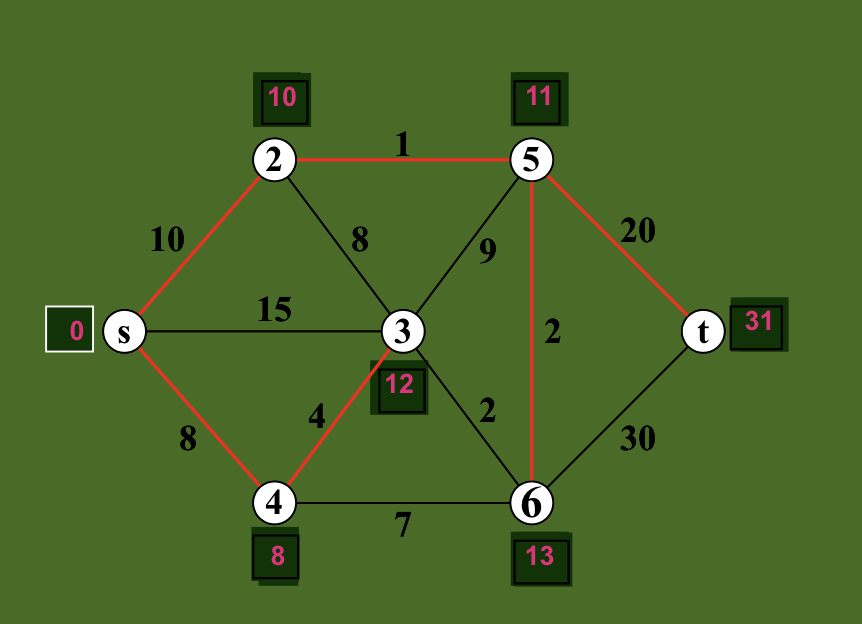
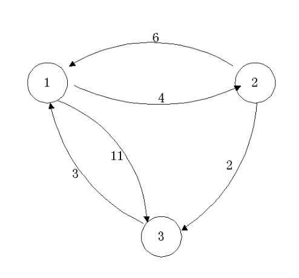
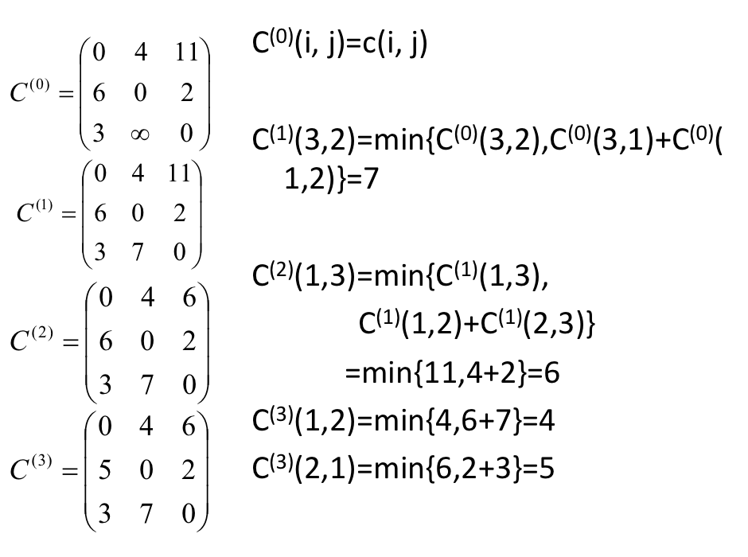
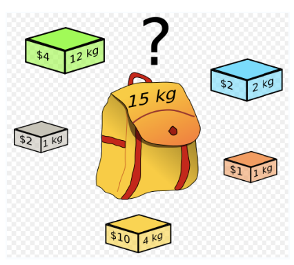
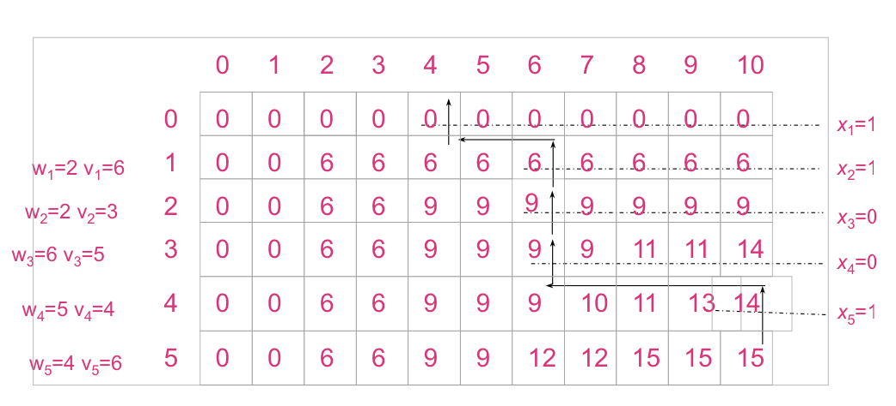

# Lecture 7

> 真的明白动态规划吗？

## Dynamic Programming

### Intro

来看一个最简单的「递归」例子：

```python
def Fibonacci(n: int) -> int:
    if n == 1 or n == 2:
        return 1
    return Fibonacci(n - 1) + Fibonacci(n - 2)
```

非常容易分析出，这个算法的时间复杂度是指数级别的。虽然他是那么的简洁、明了、又漂亮。但就是太慢了。

主要的耗时在于，从大到小的计算会带来大量的重复运算。

即，在我们算 $F(n)$ 时，会独立地计算 $F(n - 1)$ 和 $F(n - 2)$。然而实际上两者的运算基本上是重复的，平白无故花了一倍的时间。而且每个子问题的运算同样存在重复问题，这就导致时间开销进一步增大。

那么，有办法将时间复杂度缩减吗？答案是当然的。

首先，我们可以用 $O(1)$ 的代价，根据 $F(n - 1)$ 和 $F(n - 2)$ 算出 $F(n)$。由此，我们可以知道，如果我们从小到大地计算 $F(i)$，并且每一次都将上一个运算值记录在案，就能将时间复杂度缩减到 $O(n)$ 的水平。

```python
@better
#!/usr/bin/env python

def Fibonacci(n: int) -> int:
    if n < 3:
        return 1
    f_n_1 = 1
    f_n_2 = 1
    for _ in range(3, n + 1):
        f_n = f_n_1 + f_n_2
        f_n_1, f_n_2 = f_n, f_n_1
    return f_n
```

例如这里，我们只需要每次记录当前 `n` 对应的前两个值，就足够计算出 `F(n)` 了。显然这是个 $O(n)$ 时间的算法。

> 这其实不能算一个动态规划。最多算半个 Cache。

### Idea

如果能够保存已解决的子问题的答案，而在需要时再找出已求得的答案，就可以避免大量重复计算，从而（或许能）得到多项式时间算法。

像是之前的「递归」、「分治」，其实都是自顶向下的；从一个困难的问题逐渐分割、递减到一个平凡情况。在各个问题的解决之间独立的时候，或者是问题的规模下降得很快（至少要指数级别下降才能抵消递归的代价）时，这是合适的。

但如果是每个子问题之间不独立、相互依赖，那么独立的算法就不合适。

动态规划的想法是：

* 找出最优解的性质、刻画其结构特征
* 递归地定义最优值
* 自底向上地计算最优值
* 根据计算最优值得到的信息，构造最优解

### Problems

#### Continuous Matrix Multiplication

矩阵连乘问题。给出 $n$ 个矩阵 $A_1$、$A_2$、$\dots$、$A_n$。假设他们之间两两可乘，也就是他们可以连乘，求出
$$
A_1 \times A_2 \times \dots \times A_n
$$
由于矩阵乘法存在结合律，所以可以任意选择乘法的顺序。

容易得出，不同的乘法顺序，带来的数乘次数是不同的

不考虑 Strassen 的快速数乘算法，$A_{m \times n} \times B_{n \times o}$ 所消耗的数乘数量是 $n \times m \times o$。因为结果矩阵是 $m \times o$ 形式，而每个值都是通过两个 $n$ 长度的向量数乘得来的。

那么，不同的组合方式还真的会造成不一样的结果。


怎么找出那个数乘数量最少的组合方式呢？（显然，这是个很实际的问题。）

##### Brute Force

蛮力法：遍历每一种情况。那么到底有多少种情况呢？

一共有 $n - 1$ 个乘号。那么一共有 $(n - 1)!$ 种不同的计算顺序。

而每次计算消耗的时间复杂度…不敢想了。还是算了。

##### DP

分析一下最优化的结构，有下面的推论：

假如计算矩阵连乘 $A[i : j]$ 的某一次序是最优的，那么其中计算矩阵子链 $A[i:k]$ 和 $A[k + 1 : j]$ 的次序也是最优的；否则，总可以通过将其替换为最优次序来得到一个更优的连乘策略。

即，这个问题并非是完全独立的；每次产生的子问题并非完全独立（子问题的重叠性质）。所以，有记忆性的 DP 适合这种问题的解决。

通常，不同的子问题个数随问题的大小呈多项式增长。如果使用动态规划算法得当，减少重复运算，可能得到多项式时间的解决方法。

用一张动态规划表 `DP[i][j]` 来记录 `A[i:j]` 子列的最少计算次数。那么，如果要将 `A[i:k]` 和 `A[k+1:j]` 组合得到 `A[i:j]`，只要再加上其连接处的 $o \times n \times m$ 就可以了。而 `A[i:i]` 始终是 `0`，这样，很显然地我们可以用 $O(n^3)$ 的时间完成计算，同时只消耗 $O(n^2)$ 的空间。


我们用这种次序进行计算。因为 `A[i:j]` 隐含了 `i <= j`，因此实际上这张表只需要填上半三角。

```c++
static void matrixChain(int[] p, int[][] m, int[][] s)
{
    int n = p.length - 1 for (int i = 1; i <= n; ++i)
    {
        m[i][i] = 0;
    }
    for (int r = 2; r <= n; ++r)
    {
        for (int i = 1; i <= n - r + 1; ++i)
        {
            int j = i + r - 1;
            m[i][j] = m[i + 1][j] + p[i - 1] * p[i] * p[j];
            s[i][j] = i;

            for (int k = i + 1; k < j; ++k)
            {
                int t = m[i][k] + m[k + 1][j] + p[i - 1] * p[k] * p[j];
                if (t < m[i][j])
                {
                    m[i][j] = t;
                    s[i][j] = k;
                }
            }
        }
    }
}
```

就，老老实实算就好了。

或者，如果你不能确切地想出填表的顺序，可以直接写个递归 + Cache，每次遇到没求过的就写入表中，遇到表中提供了的就不再写。

这增加了一些函数调用开销，但是编码更简单，也减少了可能的 Bug。

#### Longest Common Subsequence Problem

最经典的一个 DP 例子。

* 定义：从一个序列中任意选择一些元素，保留其原有顺序地得到的结果序列称为「子序列」。

现在，给出任意两个序列 `A` 和 `B`，求他们之间「最长的公共子序列」。

##### Brute Force

长度为 $n$ 的序列一共有 $2^n$ 种不同的子序列（包括空）。暴力算法会花上 $O(n \times 2^n)$ 的时间。完完全全不可行。

##### DP

很容易可以想出，用一张 `DP[i][j]` 的表来表示 `A[:i]` 和 `B[:j]` 的最长公共子序列；

首先，所有边缘位置（即 `i == 0 or g == 0`）的 `DP[i][j]` 都应为 `0`。

其次，如果 `A[i] == B[j]`，那么就可以安全地将 `DP[i - 1][j - 1] + 1`，并作为 `DP[i][j]` 的结果。

假如 `A[i] != B[j]`，那么就取 `DP[i - 1][j]` 和 `DP[i][j - 1]` 的较大值作为 `DP[i][j]` 的结果。

非常自然的想法。从左上角向右下角填写这张表，就可以了。

空间复杂度显然是 $O(n^2)$；而由于每填写一个格子的开销仅仅是 $O(1)$ 级别，因此时间复杂度也仅仅是 $O(n^2)$。

#### Shortest Path

这个问题可以表述为：计算一张加权图中两节点之间的最短路径。

##### Data Structure

首先规定数据结构：

对无向图来说，令 $d_{ij}$ 表示 $v_i$ 到 $v_j$ 的直接距离（如果两点之间有边存在）。若他们之间没有边存在，则令 $d_{ij} = \infin$。

对有向图来说，若 $i$ 点和 $j$ 点之间仅有一条 $i$ 到 $j$ 的有向边，则 $v_{ij} = V$，$v_{ji} = \infin$。

另外，规定 $v_{ii} = 0$。

##### Dijkstra's Algorithm

Dijkstra 在 1959 年提出的算法。

* 令始点 $T_s=0$，并用框框框住。所有其它节点临时标记 $T_j = \infin$。
* 从 $v_s$ 出发，对其相邻节点 $v_{j1}$ 进行临时标记，有 $T_{j1} = d_{s, j1}$。
* 在所有临时标记中找出最小者，并用框框框住，设其为 $v_r$。
	* 若此时全部节点都永久标记，算法结束；否则到下一步。
* 从新的永久标记节点 $v_r$ 出发，对其相邻的临时标记节点进行再标记。
* 设 $v_{j2}$ 为其相邻节点，则 $T_{j2} = \min \{ T_{j2}, T_r + D_{r, j2} \}$，返回第 3 步继续。

> $T_{j2} = \min \{ T_{j2}, T_r + D_{r, j2} \}$，就可以避免出现「两边之和大于第三边」的绕路情况了。

理解：每次迭代只会有一个节点获得永久标记。如果有两个及以上的节点临时标记同时最小，则任选一个。

因为我们总是从一个新的永久标记开始迭代，因此这是一种 DFS（深度优先求法）。

因为每一次都能将一个节点加入永久标记列表，因此最多只有 $n - 1$ 次迭代。

这一算法适用于：无向图，以及不包含平行边、自环的有向图。

注意，这一简单版本的 Dijkstra 算法无法处理负权边。



Dijkstra 算法的执行过程可以理解成填写一张「`DP[t]`」表；其中包含的每个 `t` 是从原点 `s` 到 `t` 的最短路径。

##### Warshall-Floyd's Algorithm

1962 年提出。他可以解决有「负权值」边的问题。她不允许存在「负权值回路」（否则你可以在这个地方不停地把权值刷小），但可以对此情况进行检测。

这一算法一次求出所有点之间的最短路径。

算法内容如下：

对给定的点间初始距离矩阵 $d_{ij}$，但是令 $d_{ii} = \infin$。

$\forall j = 1, 2, \dots, n$，$\forall i$，运算 $d_{ik} = \min \{d_{ik}, d_{ij} + d_{jk} \}$。$k \ne j$，但是 $k$ 可以 $ = i$。

对所有的 $j$ 完成计算之後，$d_{ik}$ 最终就是 $i$ 到 $k$ 之间最短路的长度。

例如，对于下面这个不包含负权环的图来说：



可以表示成矩阵
$$
A = \left[
 \begin{matrix}
   \infin & 4 & 11 \\
   6 & \infin & 2 \\
   3 & \infin & \infin
  \end{matrix}
  \right]
$$
因此做三次迭代的结果就是：



Warshall-Floyd 算法结束。

#### 0/1 Knapsack Problem

给出 $n$ 种物品和一个背包。每种物品只有一个。物品 $i$ 的重量是 $w_i$，价值是 $v_i$。用有序数对 $(w_i, v_i)$ 来表记一样物品。

背包的容量有限，是 $C$（最多只能装得下重量和为 $w_i$ 的物品）。

对于每个物品来说，要么将其放入背包（1），要么不放入（0）。不可以对其进行分割。

求可以用这个背包带走的所有物品的最高价值。



##### Analysis

首先，来看看如果物品可分割，我们该怎么做。

显然，我们应该尽量多放那些「平均价值」较高的物品；即，将所有物品按照 $\dfrac {v_i} {w_i}$ 降序排列，按照此次序装填背包，直到最後充满。（可以证明，这里贪心法是正确的。）

> 因为物品可以分割，所以最终一定能填满的。

但是目前物品无法分割，这就导致贪心算法无法适用；考虑到将一个 $(3, 3.1)$ 的物品放入容量为 $4$ 的背包，并不比将两个 $(2, 2)$ 的物品放入其中好。

这里，我们需要更多的信息和计算——DP 或许可以适用。

首先，列出我们的限制式：在 
$$
\sum_{i = 1}^{n} w_i x_i \le C, $x_i = \{0, 1\}
$$
的条件下，要求
$$
\sum_{i = 1}^n v_i x_i
$$
的最大值。

因此，我要找的实际上就是一组 $(x_1, x_2, x_3, \dots, x_n)$，符合 $(3)$ 式，同时又使得 $(4)$ 式最大。

> 这也就预示着我们能找到 $O(n \times 2^n)$ 的暴力算法…罢了罢了

但是，我们可以给出一个递推式。

设 `V(i, j)` 是对物品列表 `O[:i]` 来说，放入容量为 `j` 的背包所能带来的最大价值。

显然，有：

* 如果 `i = 0`（没有物品可以放入）或者 `j = 0`（没有空间可以放物品），`V(i, j) = 0`。
* 如果 `j < w_i`（第 `j` 个物品不可能被放入背包中），那么就直接等于 `V(i, j) = V(i - 1, j)`。（可以放弃这个物品）
* 否则，这第 `j` 个物品就可能被放入。
	* 如果被放入，那么 `V(i, j)` 就是 `v_i + V(i - 1, j - w_i)`。
	* 如果不被放入，那么 `V(i, j)` 就等于 `V(i - 1, j)`。

用这种方法，每次迭代都能将 `i` 减小 1。所以实际上这是个 $O(nC)$ 时间复杂度、$O(C)$ 空间复杂度的算法。

> 注意：这是一个假多项式时间算法！算法时间复杂度严重依赖于 $C$ 的大小。

但是，这样填出来的 `V[i][j]` 表只能算出「最高价值」。如何确定到底是哪些物品被装入背包了呢？

答案是从 `V[i][C]` 开始往左上逆推。如果 `V[i][C] > V[i - 1][C]`，那么就说明这第 `i` 个元素被放入了背包。然后，将 `C` 减去 `w_i`，继续找到下一个背包中元素。

即，可以通过
$$
x_i = \left\{  
             \begin{array}{**lr**}  
             0, & V(i, j) = V(i - 1, j) \\  
             1, j \larr j - w_i & V(i, j) > V(i - 1, j)
             \end{array}  
\right.
$$
算出第 $i$ 个元素是否进入背包。



如此这般。

## Homework

* 7.7
* 7.9
* 7.21

