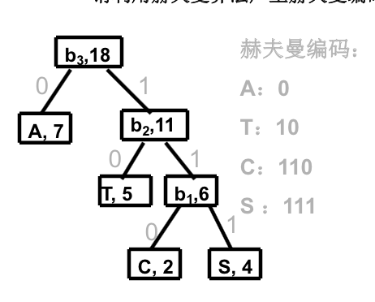

# Lecture 8

> 贪婪…

## Greedy Approach

### Definition

简单的定义就是，贪心算法总是做出「当前状态下」看起来最好的选择，而不从整体最优考虑。

> 例如，在 Compilers 中，指令覆盖问题就可以用贪心算法解：自顶向下地始终用较大的瓦片来做覆盖。但这个解不是全局最优的。

请一定注意：任何位置都局部最优，不能推出全局最优。但是基于下面两件事实：

1. 对于某些问题，贪心算法确实可以得出全局最优解。（例如单源最短路径问题、最小生成树问题等）
2. 在大部分情况下，即便贪心算法得到的不是最优解，也一般是最优解的近似。

因此，了解贪心算法的设计、以及最优解的证明还是有必要的。

### Examples

有时候，一个问题是否可以用「贪心算法」求最优解是很难直接观察出来的。

#### Knapsack

例如，普通（可切分）背包问题和 0-1 背包问题看起来极为相似，也都具有最优子结构（可以根据子问题的最优解构造组合问题的最优解）性质，但贪心算法就是只对普通背包问题适用，而对 0-1 背包问题不适用。

求解可分背包问题的贪心算法非常显然：按照 $\dfrac {v_i} {w_i}$ 降序排序，一个一个往里面装，最後一个装不下的切分开来装进去，就好了。

但是问题是，这对 0-1 背包问题来说不成立；主要原因是无法保证最终能将背包装满。而这部分闲置的背包空间导致已装入物品的单位价值降低。

#### Single Source Shortest Path

考虑如下叙述的「单源最短路径问题」。给出一个带边权的有向图 $G = (V, E)$，且保证每条边的权值都非负。

现在给定 $V$ 中的一个顶点，称为「源」，计算其到所有其他顶点的最短路长度（路径上各边权值之和）。

这就是「单源最短路径问题」。

Dijkstra 算法的思路就是，设置顶点集合 $S$ 并不断地作贪心选 择来扩充这个集合。一个顶点属于集合 $S$ 当且仅当从源到该顶点的最短路径长度已知。

初始时，$S$ 中仅含有源。设 $u$ 是 $G$ 的某一个顶点，把从源到 $u$ 且中间只经过 $S$ 中顶点的路称为从源到 $u$ 的特殊路径，并用数组 `dist` 记录当前每个顶点所对应的最短特殊路径长度。

Dijkstra 算法每次从 $V - S$（就是还不知道最短路程的那些顶点）中取出具有最短特殊路长度的顶点 $u$，将 $u$ 添加到 $S$ 中，同时对数组 `dist` 作必要的修改。一旦 $S$ 包含了所有 $V$ 中顶点，`dist` 就记录了从源到所有其他顶点之间的最短路径长度。

#### Minimum Cost Spanning Trees

有权无向图最小生成树。这个简单。

随便选择一个源点，加入已知集合 $S$，在 $S$ 和 $V - S$ 之间的边，每次选一根最短权值的边加入；直到 $V = S$。

> 因为最小生成树最後一定要覆盖所有的顶点，因此选择谁作为源点无所谓。

> 这个唤做 Prim 算法。

或者，每次都选择边权最小的边加入，除非「她和已有的边构成了回路」。

> 这个唤做 Kruskal 算法。

这两个都是贪婪算法，但最後的结果都是最优的。

#### Huffman Code

一种变长压缩算法。其思路是这样的：用较短的代码来编码经常出现的 Pattern，用较长的代码来编码不常出现的 Pattern。

并且，由于其中每个 Code 都不是另一个 Code 的前缀，因此无需分隔符即可编解码。

那么，给出一套频率分布 $(c_i, f_i)$（字符串：出现频率），怎么给他们编码使得压缩率更高呢？

Huffman 提出的算法如下。

用二叉树来表示编码；从根部开始，向左走定义为 0，向右走定义为 1。只采用叶子结点对应实际编码（可以保证互不为前缀）。

然後，以这种格式来编码：

始终选择左子树（或右子树）来迭代地分形，就可以了。

## Homework

* 证明最短路径算法的正确性
* 证明最小生成树算法的正确性
* 证明 Huffman 算法的正确性

