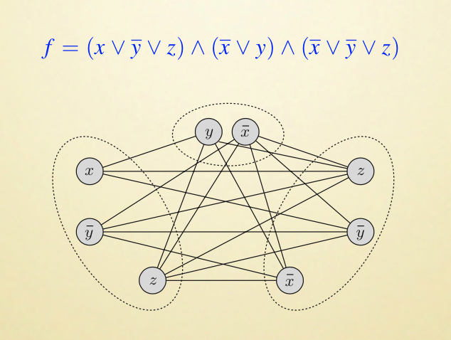
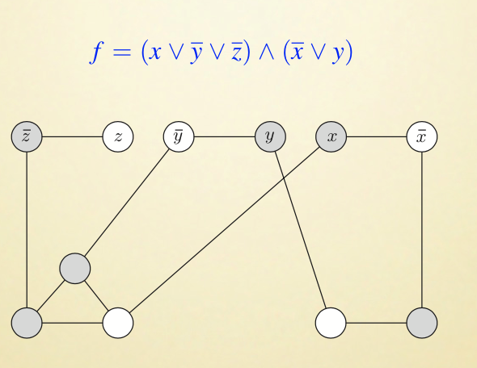
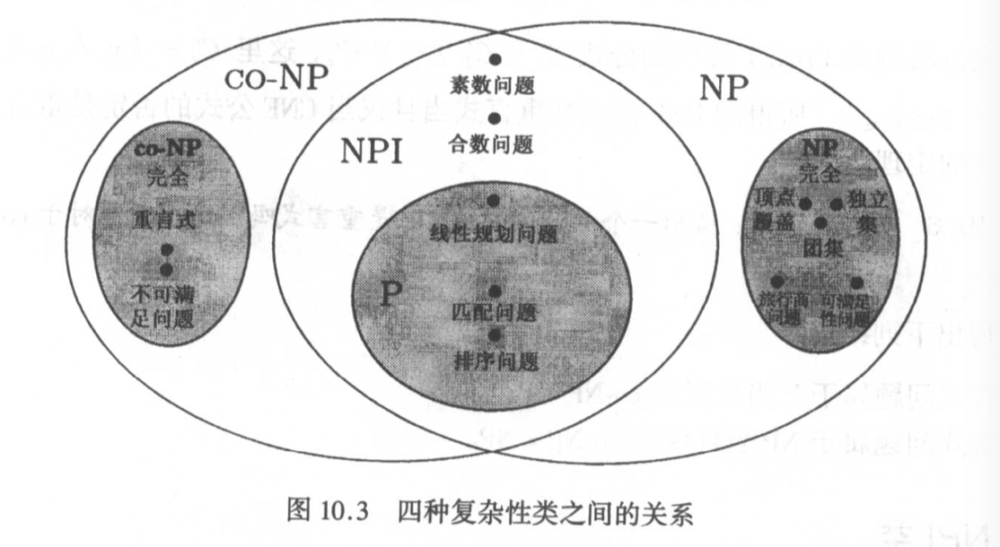

# Lecture 1

> LI Guoqiang's

## Algorithm

> 李国强老师的「算法」就比较抽象了。

### Definition

定义「算法」为：

* 精确的（没有模糊空间）
* 机械化的（不需要依赖灵感、运气、怪力乱神）
* 有效的（能在合理的时间内得到结果）
* 正确的（结果不能是错的）

一套步骤。

### P & NP

以上四个表述之中，最模糊的好像就是「有效的」了。在合理的时间内完成…这算什么话。多长时间算合理？

看一些算法作为例子。

* 寻找图中的最短路径
* 寻找最小生成树（MST）
* 二分图匹配
* 求最大递增子序列
* 求网络中的最大流
* ……

以上这些问题的最优算法都是「多项式时间」的——即，时间复杂度在 $O(n^k)$ 级别（$k$ 是常数）。例如，$O(n)$、$O(n^2)$、$O(n^3)$ 之类的。

这些算法（以及比他们时间复杂度更低的算法）都可以被称之为有效的。

而根据输入数据的量级，耗时呈现指数级增长的算法（即 $O(k^n)$ 复杂度的算法）称之为无效的算法。

对于树、图、匹配类问题，如果你的算法需要逐一检查每一类情况，那么这个算法大概率是无效的（$O(k^n)$！）。

> 实践之中，我们一般认为比 $\Theta(2^n)$ 还差的算法没有使用的必要。

> 因此这里我们把「有多项式时间算法」的问题称为 P（取「多项式」英文的首字母）问题；而「没有、或者不太可能有多项式时间算法」的问题称之为 NP（非多项式时间）问题。

## Example

### Finding my MST

有时候写出 Inefficient 的算法，不一定是这个问题太难，可能是因为你没动脑子。

> 例如，要写出寻找 MST（最小生成树）的算法，写出一个「检查 $2^E$ 种情况（$E$ 是边数），找出其中权值最小的那一种」，那是完全不可以的。但是，如果改为使用 Prim 算法或者 Kruskal 算法，那么就变成了一个轻松的 $O(E)$ 级别问题了。

但是，只要加上一点点限制条件（如：不允许有分叉），我们就找不出多项式时间的算法了——问题就退化到了 $\Theta(2^n)$ 的情况。

### Satisfiability Problem

可满足性问题。即，给出一堆布尔变量以及它们组成的一些谓词逻辑，问是否存在一组布尔变量的取值，使得整个语句为真。

例如，给出 $x$、$y$、$z$，问是否存在一组 $(X, Y, Z)$ 取值，使得
$$
(x \or y \or z)\and(x \or \overline{y}) \and (y \or \overline{z}) \and (z \or \overline{x}) \and ({\overline{x} \or \overline{y} \or \overline{z}})
$$
为真？

最明显的解决方案就是遍历 $2^3$ 种取值。但是当 $n$ 增大时——不要说很大，只要稍微增大一点——就会导致整个算法的耗时不可接受。

> 对于一般性的 SAT 问题，我们目前没有什么思路。

### 2-SAT Problem

我们来考虑一个略微退化一点的问题：每个 Clause 都只有两个变量。即，形如：
$$
\left(x_{1} \vee x_{2}\right) \wedge\left(\bar{x}_{1} \vee x_{3}\right) \wedge\left(x_{1} \vee \bar{x}_{2}\right) \wedge\left(x_{3} \vee x_{4}\right) \wedge\left(\bar{x}_{1} \vee \bar{x}_{4}\right)
$$
这样的 Clauses，要判断其可满足性，有没有什么更好的办法？

对于一个含有 $n$ 个变元和 $m$ 个 Clause 的 2-SAT 问题，我们可以构造出一个图 $G_I = (V, E)$。$G_I$ 含有 $2n$ 个节点，每个变元及其否定都作为节点出现。

然后，对于每一个 Clause 形如 $(\alpha \or \beta)$，在 $\overline{\alpha}$、$\beta$ 之间连一条线；并在 $\overline{\beta}$、$\alpha$ 之间连一条线。

> 也就是把每个 Clause 理解成推论的形式：在 Clauses 为真的情况下，$\overline{\alpha} \Rightarrow \beta$；同时也有 $\overline{\beta} \Rightarrow \alpha$。

这样，我们只需要找出 $G_I$ 中所有的强连通子图，检查其中是否有同时包含 $x$ 和 $\overline{x}$ 的情况。如果有，那么 $I$ 就不可满足。

> 相当于是出现了 $x \Rightarrow \overline{x}$ 的重言式。

否则，$I$ 就是可满足的。

> 这一套算法——找强连通子图、判断其中是否存在重言式——是可以在线性时间内完成的。

### $n$-SAT Problem

非常遗憾，除了 2-SAT 问题以外，更困难的 SAT 问题，不要说线性时间的算法，连多项式时间的算法也没有。

## Problems

### Tractable & Intractable

我们可以大概地把问题分为两类。

一类是容易解决的（Tractable）；即，我们已经找到了多项式时间算法的问题。

另一类则是难解的问题；即，还没有找到（而且也不大可能找到）多项式时间算法的问题。

> 这样的分类似乎有点笼统：难解的问题那么多，甚至还有一些理论上不可解的问题（如停机问题）。

### Decision & Optimization Problem

从问题的形式出发进行讨论。

有些问题只需要回答 Yes 或 No；有些问题则需要找出「最大值」、「最小值」等。

只需要回答「是/否」的问题叫做「判定」问题；而要求求出具体值的问题则称为「最优化」问题。

> 注意：不要把 Dec & Opt 问题和 P & NP 问题混为一谈。并不是所有的 Dec 问题都是多项式时间可解的；也不是所有的 Opt 问题都是非多项式时间的。

例如，考虑下面两个问题：

* 输入：给出一组整数。

* 判定问题：$S$ 中有没有两个元素是相等的？

* 最优化问题：$S$ 中元素的最高出现频率是？

感受一下他们的区别。

> 当然，这个最优化问题并不难解；可以用 $O(n \log n)$ 的时间解决它。

### Examples

#### Clique

团集问题。

> 团集定义为一组顶点的集合，其中任意两个顶点都有边连接。

考虑下面这个问题：

* 输入：一个无向图 $G = (V, E)$ 以及一个正整数 $k$。
* 如果 $G$ 有大小为 $k$ 的团集，输出 Yes；否则输出 No。

以及：

* 输入：一个无向图 $G = (V, E)$。
* 输出：$G$ 中最大团集的大小。

> 显然，如果我们找出了最优化问题的解，那么这个算法可以很容易地被用来解决判定问题。

#### Coloring

着色问题。

> 图的一个「着色」定义为给图的每一个节点分配一种颜色，使得任何一条边所连接的两个节点均不同色。

看这个判定问题：

* 输入：一个无向图 $G = (V, E)$ 和一个正整数 $k \ge 1$。
* 如果 $G$ 可以用 $k$ 种颜色着色，输出 Yes；否则输出 No。

以及和他相关的那个最优化问题：

* 输入：一个无向图 $G = (V, E)$。
* 输出：给 $G$ 着色，最少需要多少种颜色。

> 这两个问题即使是在 $k = 3$ 的情况下也是非常难解的。

对于这种相关联的「判定」−「最优化」问题，可以说如果解决了最优化问题，就能很容易地解决任何判定问题。

## P, and NP

下面，我们来系统性地对问题进行分类。

### P Class

可以在多项式时间内解决的问题。

例如，2-Coloring（$k = 2$ 的上色问题）、2-SAT（每个 Clause 只有两个变元的可满足性问题）、等等。

一旦某个问题进入了 P 集合，那么这个问题的补问题也在 P 集合内。

> 「判定问题」才有「补问题」一说。
>
> 简而言之，对于判定问题 $A$ 和 $B$，如果对任何输入 $x$，都有 $A(x) = \overline{B(x)}$，则称 $A$、$B$ 互为补问题。

### NP Algorithms

给出一个输入 $x$，如果他包括以下两个步骤：

* 猜测。
	* 从可能的解集合中挑选出一个。
	* 通常来说，这样的可能解数量是指数级别的。
* 验证。
	* 验证第一步之中取出的可能解是否真的是解。
	* 如果是，则输出；如果不是，则返回第一步。

记这种问题 $\Pi$ 的指数时间算法为 $A$。如果 $A$ 中的第二步「验证」只花费多项式时间（也就是说，这是个 P 判定问题），那么就称这个问题为 NP 问题（「验证」步骤值消耗多项式级别时间）。

### P−NP Pair

给出一个 NP 问题，那么其中「验证部分」就是一个 P 判定问题。

更严密的定义如下：

P 问题是一类我们可以用多项式时间解决的**判定问题**。

> P is the class of decision problems that we can decide or solve using a deterministic algorithm that runs in polynomial time.

NP 问题是一类「给出一个断言解（实例），我们可以用多项式时间验证其正确性。假如其正确，就足够对原问题回答 Yes」的判定问题。

> NP is the class of decision problems that we can check or verify their solutions using a deterministic algorithm that runs in polynomial time

> 注意，这里并没有说 NP 就一定要指数级时间解决。也没说一定能多项式时间解决。
>
> 俗称的「证明 $P = NP$」，也就是证明所有「可多项式时间验证结果」的问题也都能在多项式时间内解决。

简而言之，这就是「多项式时间内能找出解」和「多项式时间内能验证解」问题的区别。

## NP-Complete

### Induction

问题之间不是独立的。例如，对于两个判定问题 $\Pi$ 和 $\Pi'$。

如果存在一个确定的算法 $A$，给他一个 $\Pi$ 的输入 $I$，他能在多项式时间内将其转化为一个 $\Pi'$ 的输入 $I'$，使得 $\Pi(I)$ 和 $\Pi'(I')$ 同真同假，则称 $\Pi$ 可规约成 $\Pi'$。

显然，假如 $\Pi'$ 可以在多项式时间内解决，那么 $\Pi$ 也可以在多项式时间内解决（只要走一次转换就好了）。

可以记作 $\Pi \propto_{poly} \Pi^{\prime}$。

### NP-Hard Questions

现在考虑 NP 集合中现有的那些问题。显然他们的难度不是相同的。如果我们试着做「规约」，会发现其中有一些问题好像是「最难的」。即，NP 中任何一个问题 $\Pi'$，都可以被规约成的问题 $\Pi$。

也就是说，如果这种问题 $\Pi$ 可以在多项式时间内被解决，那么所有的 NP 问题就都可以在多项式时间内解决了。

这种问题，我们称之为 NP-Hard 问题。

### NP-Complete Questions

如果一个 NP-Hard 问题同时属于 NP 集合，就称之为 NP 完全问题。

> NP-Hard 问题未必属于 NP；NP-Complete 问题一定属于 NP。

### Example

笼统地研究 NP 问题没什么意义。比如我就可以写出一个 NP 问题：

> 输入一个整数 $A$，输出比他小 1 的数。

显然，这个问题是 NP 问题（结果可以在多项式时间内验证），同时也是 P 问题。

我们关心的是那些「最难的」NP 问题——即，如果他们是多项式时间内可解决的，那么所有的 NP 就都是多项式时间内可解决的了。

> 有这种好事？

#### Hard Questions

以下问题都是 NP-Complete 的：

* 任意范式的可满足性问题
	* 实际上，3-SAT 就已经是 NP-Complete 的了。

> 事实：SAT 问题 $\propto_{poly}$ 3-SAT 问题。

* 任意无向图的汉密尔顿回路
	* 指经过所有节点一次且仅一次的回路。
* 旅行商问题
	* 给出一张加权图，问是否存在一条汉密尔顿回路，使得其路程不长于 $c$。
* 最长路径问题
	* 给出一张加权图和其中两个不同顶点 $s$、$t$。给出一个正数 $c$，问是否有一条从 $s$ 到 $t$ 的**简单**路径，使得路径的权值大于 $c$。
* 切分问题
	* 给出一整数集合 $S$，问是否能将其拆分为两个子集合 $S_1$ 和 $S_2$，使得两个子集合的数字和相同。
* 0−1 背包问题
	* 就是姜老师用 DP 解决的那个问题。
* 背包问题
	* 给出一组物品和背包容量 $C$，问是否存在一种填充背包的方法，使得背包刚好被填满，而且其中物品的价值不低于 $C$。
* 集合覆盖问题
	* 给出一个集合 $X$，一堆 $X$ 的子集合 $\mathcal{F}$、以及一个整数 $k$。问是否可能从 $\mathcal{F}$ 中取出 $k$ 个子集合，使得他们的并集等于 $X$。

> 事实：汉密尔顿回路问题 $\propto_{poly}$ 旅行商问题。

* 团集问题
	* 给出一张无向图和正整数 $k$，确认其中是否有 $k$ 大小的团集。
* 顶点覆盖问题
	* 给出一张无向图和正整数 $k$，确认其中是否有 $k$ 个顶点接触到任何边。

> 事实：顶点覆盖问题 $\propto_{poly}$ 集合覆盖问题。

* 不相关集问题
	* 给出一张无向图和正整数 $k$，确认其中是否有 $k$ 个顶点，两两所连成的边都不在图之中。
* 着色问题
	* 给出一张无向图，确认是否有用 $k$ 种颜色进行着色的办法。
	* 实际上，3-Coloring 就已经是 NP-Complete 的了。
* 三维匹配问题
	* 给出 $X$、$Y$、$Z$ 是三个包含 $k$ 个元素的数组。$W$ 是一组三元数 $\{(x, y, z) | x \in X, y \in Y, z \in Z\}$。问是否存在一组大小为 $k$ 的 $M$ 的子集，使得其中恰好覆盖 $X$、$Y$、$Z$ 中的每个元素？

#### Induction

事实：任意可满足性问题 $\propto_{poly}$ 团集问题。

> 将 $m$ 个语句、$n$ 个变元的可满足性问题画成 $2n$ 个顶点图的形式，则「原式可满足」等价于「这张图有大小为 $m$ 的团集」。
>
> 

事实：任意可满足性问题 $\propto_{poly}$ 顶点覆盖问题。

> 将 $m$ 个语句、$n$ 个变元的可满足性问题这么操作：
>
> 对每一个变元 $x_i$，构造一组相连的顶点，分别命名为 $x_i$ 和 $\overline{x_i}$。对每一个 $f$ 中，有 $n_i$ 个谓词的语句 $C_i$，构造一个大小为 $n_i$ 的团集，且分别连接到对应的谓词上。
>
> 
>
> 此时，「原式可满足」等价于「这张图有大小为 $k$ 的顶点覆盖」。

事实：顶点覆盖问题 $\propto_{poly}$ 独立集问题。

> 在 $G$ 是个连通无向图的情况下，「$S \subseteq V$ 是一个独立集」等价于「$V - S$ 是 $G$ 的顶点覆盖」。

## co-NP

指的是那些「补问题」是 NP 的问题。称之为反 NP 问题。

反 NP 问题的定义是是一类「给出一个反例，我们可以用多项式时间验证这个反例。如果这个反例确实，就足以对这个问题回答 No」的判定问题。

同样的，co-NP 问题中也有最难的问题，就是所有问题都可以多项式规约到的问题。称之为 co-NP 完全问题。

例如，旅行商问题的补就表述为「给出 $n$ 个城市和他们之间的距离，不存在长度短于 $k$ 的游程」。显然这个命题如果为假，那么可以通过一个简单的反例（长度短于 $k$ 的游程）来回答 No；但是如果要回答 Yes，要做的工作量可能是 $O((n - 1)!)$ 级别的！

> 定理：「$\Pi$ NP 完全」等价于「$\overline{\Pi}$ co-NP 完全」。

这个可以直接通过运算符的取逆得到。

## NPI

如果存在一个问题 $\Pi$ 和他的补问题 $\overline{\Pi}$ 都是 NP 完全的，那么 co-NP = NP。

> 目前我们不认为 co-NP = NP（因为他们太不一样了）。

但是，的确存在 $\Pi$ 和 $\overline{\Pi}$ 都属于 NP 的情况。例如：

* 素数问题：给出一个整数 $k \ge 2$，他是素数吗？
* 合数问题：给出一个整数 $k \gt 4$，他是合数吗？

显然，素数问题是一个 co-NP 问题——只需要一个 $k = p \times q$ 就可以对他回答 No；而合数问题是一个 NP 问题——只需要一个例子就可以回答 Yes。

但是，更不明显地，素数问题也是一个 NP 问题（很难证明，但这的确是真的）。换句话说，合数问题也是个 co-NP 问题。

> 即，质数和合数问题都是 NP 问题，也都是 co-NP 问题。

那么，我们现在考虑一下素数问题是否是 NP-Complete 的呢？即，是否所有的 NP 问题都可以规约到素数问题上呢？

假设「素数是 NP-C 问题」为真，即素数问题是一个 NP-C 问题。那么，他的逆问题「合数问题」就是一个 co-NP-C 问题。即，co-NP 中的任何问题都可以规约到合数问题。但是合数问题本身也是个 NP 问题；这也就是说 co-NP 內的所有问题都可以规约到 NP 问题中去；也就是说，co-NP = NP。

> 但是大家几乎不认为 co-NP = NP。

因此，可以说前提「素数问题是 NP-C 问题」非常不可能为真。但因为实际上还不确定，所以我们新命名一个集合 NPI（NP-Intermediate）来放置这些未定问题。

> 2002 年，N. Kayal、N. Saxena、和 M. Agarwal 证明了素数问题属于 P（AKS 算法）。

## Graph

> 注意，co-NP-C 和 NP-C 问题（左右两边的深色圆圈）是几乎不可能和 NPI 有交集。
>
> 但是，如果哪天证明了 NPI 和 NP-C、co-NP-C 有交集，也就是说 co-NP = NP，从而证明 NP = P，那么这张图就完全废掉了。所以上面的图并不表示这种情况。

## Homework

### [DPV07]

* 8.3
* 8,7

### [Als99]

* 10.3
* 10.5
* 10.9
* 10.19
* 10.22