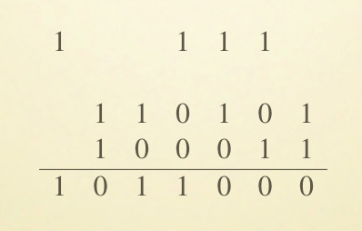
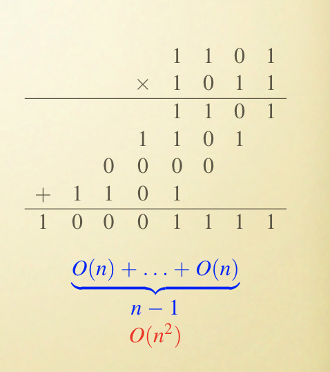
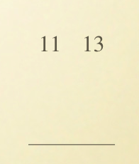
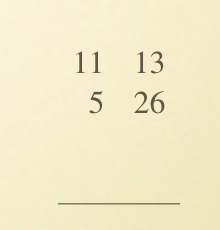
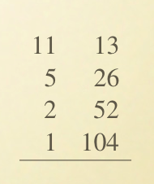
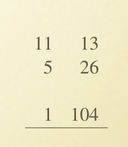
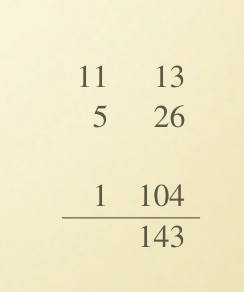
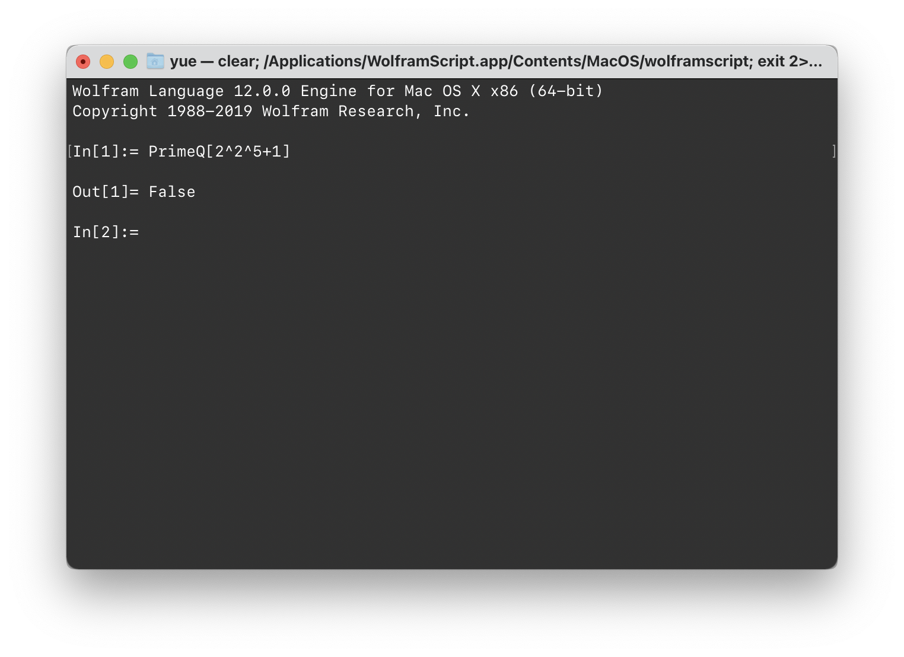

# Lecture 2

> LI Guoqiang's

涉及到数字的「算法」。

## Numberst

### Representation

数学中的自然数由 Peano Axioms 定义。

例如，用十进制表示写作 $1024$ 的数字，在计算机中的二进制表示就是 `0100 0000 0000`。

目前，几乎没有计算机的数字采用变长字节流存储。换言之，能处理的数字是有上限的。

一种常见的无上限整数实现，是这样的：

```python
class LongLongInt:
    length: uint_64
    digits: List[bool]
```

即，通过一个 `length` 来记录字节流的长度，以及一个数位缓冲区来变相表示超长的数字。

### Costs

处理一个数字的代价…是多少？

对于一个自然人来说，读、写数字 $N$ 的代价是 $O(\lg N)$。

> 因为大部分人都有十根手指，爱用十进制。

如果存在其他用七进制的外星人，那么他们的数字表示代价大概就是 $O(\log_7 N)$。

换句话说，读写一个数字的代价，取决于在特定 $k$ 进制下的数字表达位数。不妨泛泛地将其记作 $n = \log N$。

> 考虑到换底公式 $\log_b N = \dfrac {\log_a N} {\log_a b}$，而 $\log_a b$ 是常数，所以改换进制不会引起复杂度的改变。

那么，我们普通地对一个数字做加法的时间复杂度是 $O(n)$（只要对每一个数）。

做乘法相当于做 $n$ 次加法（列竖式计算的话），所以复杂度应该是 $O(n^2)$。

但是对于计算机来说，是有点可悲的。所能处理的整数都是定长的，不论是 32 位、64 位、（将来的）128 位机器。因此，要对 17 或是 1700000000 进行计算，所耗费的时间都只是固定的 Cycles，而不会因为高位都是 0 而变快。

因此通常来说，当我们描述一个计算机算法——给出一个整数 $k$时，我们实际上的意思是——给出一个固定长度（如 32 位、64 位之类的）的比特串。对这个整数做加法、乘法的时间不会引起大小而改变——基本操作。

### Operations

下面，我们更加精确地讨论一下运算的问题。

#### Addition

加法——能更好吗？



按照一开始就知道的算法，把每一位的数字和进位加起来、取模、进位…就这么一直做到头。

显然，算出每一位（及其 Carry 位）的耗时是 $O(1)$ 的。因此这种算法的时间复杂度跟结果的位数直接相关。也就是，$O(n)$。

能做得更好吗？实际上要把结果写出来都需要耗费 $O(n)$ 的时间。因此可以说不存在更好的算法了。

#### Subtraction

一样的。只不过是在计算每一位时，不采用 $a + b + \mathrm{carry}$ 的方式，而是 $a - b - \mathrm{carry}$ 的方式。

> 这里的 Carry 理解成借位，或者是值为 -1 的逆进位都好。

复杂度上跟 Addition 一致。没有什么好说的。

#### Multiplication

把两个 $n$ 位的数字乘起来，耗费显然是 $O(n^2)$。



因为要进行 $n$ 次简单的一位乘法。而每一次 $n \times 1$ 位乘法的时间复杂度也是 $O(n)$。

> 尽管对于二进制来说，$n \times 1$ 位乘法要做的其实就是选择「照搬」或「填入全 0」而已。但就是这件事也要 $O(n)$。

所以总共是 $O(n^2)$。

#### Multiplication, by Al Khwarizmi

花拉子米的乘法。

举个例子：要计算 $11 \times 13$。那么，把他们写成一排。



然後，把左边的数字折半（总是向下取整），右边的数字加倍。



一直这么做，直到左边的数字变成 1。



然後，把那些「左边数字是偶数」的列删去。



把右边的数字加起来，结果就是 $11 \times 13 = 143$。



倒是一个非常适合编程的算法……

```python
def mult(a: int, b: int) -> int:
    ret = 0
    
    while a >= 1:
        if a % 2:
            ret += b
        a //= 2
        b *= 2
    
    return ret
```

#### Multiplication, á la Françis

又是诡异的乘法算法：

```python
def mult(x: int, y: int) -> int:
    if y == 0:
        return 0
    z = mult(x, y // 2)
    if y % 2:
        return 2 * z
    else:
        return x + 2 * z
```

这种算法实际上是上一种乘法的变种，基于下面的递推式：
$$
x \times y = \left\{  
             \begin{array}{**lr**}  
             2 (x \times \lfloor \dfrac y 2 \rfloor), & \mathrm{if}\ \ y \ \ \mathrm{ is\ even} \\  
             x + 2 (x \times \lfloor \dfrac y 2 \rfloor), & \mathrm{if}\ \ y \ \ \mathrm{ is\ odd}
             \end{array}  
\right.
$$
其正确性是显然的。

因此，Al Khwarizmi 也好，á la Françis 也好，他们都是一种算法。

时间复杂度呢？

首先，迭代进行的次数是 $\log_2 N$。因为每次迭代，左边的数字都会折半。因此循环（或者递归）只会进行 $\log_2 N$ 次。也就是（粗略地说）$n$ 次。

而每一次迭代需要进行的操作有：

* 判断奇偶
* 除以 2
* 乘以二
* 一次加法（可能需要）

第一件事可以理解成判定 `x & 0x1`。常数时间内完成。

第二件事就是 `x >> 1`。第三件就是 `x << 1`。这两件事需要 $O(n)$ 的复杂度。就算只是左右移动一位，但是牵一发而动全身。

至于那一次可能的加法。如果 $y$ 永远是偶数，那么每一次都不必进行加法。

但是，按照最坏情况来分析，这个算法仍然是 $O(n^2)$ 时间复杂度的。

有办法做得更好吗？

#### Multiplication, Optimized

高斯在研究复数的乘法时，考虑到了这个式子：
$$
(a + b\mathrm{i})(c + d\mathrm{i}) = ac - bd + (bc + ad)\mathrm{i}
$$
这个式子的形式对实数也成立：
$$
bc + ad = (a + b)(c + d) - ac - bd
$$
而我们知道对于 $k$ 进制来说，$k^m \times k^n$ 计算起来非常快。因此又有下面这个式子：
$$
(a \times 2^{\frac n 2} + b) \times (c \times 2^{\frac n 2} + d) =  ac \times 2^n + ((a - c) \times (b - d) + ac + bd) \times 2^{\frac n 2} + bd
$$
突然发现，原来 $n$ 规模的乘法，现在被拆分成了 3 个 $\dfrac n 2$ 规模的算法。又因为 $\log_2 3 \lt 2$，因此相比原来的算法有进步。总的复杂度降低到了 $O(n^{log_2 3})$，大约是 $O(n^{1.59})$。

同时，这些更小规模的乘法一样也可以用这种方式加速。实际的复杂度还能更低。

> 请去看 1.6 Divide and Conquer 中的 Example / Big Integer Multiplication 一节。

## Modular Arithmetic

> 模运算

### Definition

数学里，整数是无限多的。不存在一个最大的整数 $K$。但是，在模运算中，我们强行限制其大小。

例如，我们规定「不存在大于等于 17 的数」。大于等于 17 的数字 $x$ 全部用 $x \mod 17$ 替换。

在 $\pmod{17}$ 的前提下，会出现一些反常的正确式子：

* $x \equiv x + 17 \pmod{17}$
* $14 \times 2 \equiv 11 \pmod {17}$

同样，$x \equiv y \pmod{N}$ 也不能说明 $x = y$，而只能说 $(x - y)$ 可以被 $N$ 整除。

### Rules

下面给出一些跟常见算法有关的规则。

如果 $x \equiv x' \pmod{N}$、$y \equiv y' \pmod{N}$，那么就有
$$
x + y \equiv x' + y' \pmod{N}
$$
和
$$
xy \equiv x'y' \pmod{N}
$$
存在。

也就是说，如果我们想要得到 $x y \pmod{N}$ 的值，并不需要实际去计算 $xy$，然後对 $N$ 取模，而是先对 $x$、$y$ 取模，对模做乘法，再取模得到结果。

> 差异就是，要做乘法运算的规模急剧地缩小了。

同时，模运算也遵循良好的三定律：
$$
x + (y + z) \equiv (x + y) + z \pmod{N}
$$

> 结合律（Associativity）。

$$
xy \equiv yx
$$

> 交换律（Commutativity）。

$$
x(y + z) \equiv xy + xz
$$

> 分配律（Distributivity）。

另外，在运算中的任意时刻取模，结果都是正确的。
$$
2^{345} \equiv (2^5)^{69} \equiv 32^{69} \equiv 1^{69} \equiv 1 \pmod{31}
$$

> 由于有 $xy \equiv x'y' \pmod{N}$，可以自然地推出 $x^M \equiv (x \mod N)^M \pmod{N}$。

> 但是切不可以拿指数幂取模，那就完全不对了。

### Operations

> 会有什么不一样吗？

#### Addition (Modular)

显然，我们只需要考虑两个介于 $0$ 和 $N - 1$ 地整数求和，因为超过这个范围的整数都可以通过取模归到这一类里。

那么，加和之後的结果会落在 $0$ 和 $2(N - 1)$ 内。$2(N - 1) < 2N$，因此如果最後的结果超出了 $N - 1$，也只需要减去 $N$ 就可以了。

> 这个步骤只需要花费 $O(\log N)$ 的时间。也就是，$O(n)$。

#### Multiplication (Modular)

乘法的范围也被限定在了 $0$ 和 $N - 1$ 之间（最大的位数记作 $n$）。因此，最大的乘积结果也不过是 $(N - 1) ^2$，位长也不过是 $2n$。

> 基于 $\log_2 (N - 1) ^2 = 2\log_2 (N - 1) \le 2n$。

所以，最後的时间复杂度也就是 $O(n^2)$。

#### Exponentiation (Modular)

Exponentiation，也就是计算 $x^y$ 这样的表达式。

很遗憾，$x^y \pmod{N}$ 的计算相比于 $x^y$ 并没有什么简化。

用公式 $x^M \equiv (x \mod N)^M \pmod{N}$，只能缩小底数，无法缩小指数。

但是众所周知，指数爆炸的原因是「指数太大」，这样操作没有办法抑制爆炸趋势。

而且，$x^y$ 的结果跟 $x$、$y$ 的规模完全不是一个比例。即便对于很小的底数和幂数，都是爆炸性的增长。

例如，两个 19 位的数进行幂指运算，结果的规模是
$$
(2^{19})^{2^{19}} = 2^{9961472}
$$
差不多是一千万位！

### Algorithms (for Exponentiation)

#### First Idea

第一个主意就是，做 $y$ 次乘法。

考虑到我们已经有成熟的、$O(n^2)$ 复杂度的模乘法运算，我们可以按照这样的策略：
$$
x \rightarrow x^2 \rightarrow x^3 \rightarrow \dots \rightarrow x^y \pmod{N}
$$
这样，每一次的时间耗费是 $O(n^2)$，而一共要做 $y$ 次。

> 是真真正正的 $y$ 次，而不是什么 $y\mod N$。

绝望地放弃这种方法吧。

#### Second Idea

一次只是乘 $x$，太浪费了，增长太慢。

我们取一个 $z = \lfloor \log y \rfloor$，然後向 $z$ 指数增长地逼近，如何呢？

> 从 $z$ 到 $y$ 的过程是简单的，回到 First Idea 的方法就好了。

$$
x \rightarrow x^2 \rightarrow x^4 \rightarrow \dots \rightarrow x^z \rightarrow x^{z + 1} \rightarrow \dots \rightarrow x^y \pmod{N}
$$

这样，我们只需要（大概）$\log y$ 次迭代就能逼近 $x^y \pmod N$ 了。

总的时间复杂度降低到了 $O(n^2 \log y)$。

真好。

#### Implementation

下面是我们的 MODEXP 算法：

```python
def mod_mul(x: int, y: int, N: int) -> int:
    return ((x % N) * (y % N)) % N

def mod_exp(x: int, y: int, N: int) -> int:
    if y == 0:
        return 1
    z = mod_exp(x, y // 2, N)
    if y % 2:
        return mod_mul(z, mod_mul(x, z, N), N);
    else:
        return mod_mul(z, z, N);
```

这里，每一次运算的耗时是 $O(n^2)$。而这种迭代一共要运行 $O(\log y)$ 次。

## oh-my-gcd

GCD，也就是 Greatest Common Divisor（最大公约数）。

给出两个整数 $x$ 和 $y$，要求他们的最大公约数 $\gcd{x, y}$。有什么办法呢？

### Euclid's

#### Idea

欧几里得说，有下面这个事实存在：
$$
\gcd(x, y) = \gcd(x \bmod y), y)
$$
很容易证明，只要 $x \ge y$，就有 $\gcd(x, y) = \gcd(x - y, y)$ 存在。

> 只需要我们补充一点定义：$0$ 和任何一个正整数 $k$ 的最大公约数都是 $k$。

反复做这件事情，结果就是原式。

用当代程序语言来写，就是这样：

```python
def euclid_gcd(x: int, y: int) -> int:
    if y == 0:
        return x
    return euclid_gcd(y, x % y)
```

#### Complexity

要分析复杂度，我们得先得到下面一个引理：
$$
\mathrm{if\ } a \ge b \ge 0, \mathrm{then\ } a \mathrm{\ mod\ } b \lt \dfrac a 2
$$
证明非常简单，分类讨论。

* 如果 $b \le \dfrac a 2$，那么显然模 $b$ 的结果小于 $\dfrac a 2$；
* 如果 $b \gt \dfrac a 2$，那么 $a \mathrm{\ mod\ } b = a - b \lt \dfrac a 2$。

也就是说，每一次 $a \mathrm{\ mod\ } b$ 都会至少将 $a$ 折半。

那么，假定给出的 $a$ 和 $b$ 都是 $n$ Bit 的数字，那么这个循环最多只会运行 $2n$ 次。

而每一次内部取模运算的时间复杂度是 $O(n^2)$，因此最终时间复杂度是 $O(n^3)$。

### Extended Euclid's

#### NP, and co-NP

假设我们给出两个数 $x$ 和 $y$，要判断其最大公约数是否是 $d$。这该怎么办？

> 首先这不是一个 NP 问题。因为不可能普遍地给出一个单例来「验证」$d$ 是否就是那个最大公约数。
>
> 但是，这是一个 co-NP 问题。如果我们能给出一个 $d' \gt d$，并验证 $d'$ 也是公约数，就能反驳 $d$ 不是那个最大公约数。
>
> 废话到这里结束。

这是个 co-NP 问题。但是他是 NP 问题吗？

即，是否有一个多项式时间的算法，判明 $d$ 是否是 $x$、$y$ 的最大公约数？

仅仅验证 $d$ 能整除 $x$ 和 $y$ 是不够的。没法确定是不是最大的那个。

> 因为 2.1 里讲过，NP 不太可能 = co-NP。因此，不太可能存在这样的多项式时间算法。

但是，我们并不是毫无办法。

#### Lemma

* 如果 $d$ 是 $x$、$y$ 的公约数，而且 $d = ax + by$ 对某两个整数 $a$、$b$ 成立，那么 $d$ 就一定是 $x$、$y$ 的最大公约数。

证明很轻易，两步走：

* 首先，$d \le \gcd (x, y)$
	* 这是显然的吧。
* 其次，$d \ge \gcd(x, y)$
	* 因为既然 $\gcd(x, y)$ 可以整除 $x$、$y$，他一定也可以整除 $d = ax + by$。

综上所述，$d = \gcd(x, y)$。

> 当然，满足 $d = ax + by$ 的这一组 $(a, b)$ 怎么找，没有给出任何说明。但是，贝祖向我们保证：

* 給定二個整數 $a$、$b$，必存在整數 $x$、$y$ 使得 $ax + by = \gcd(a, b)$。

> 这个叫做 Bézout's Lemma。

## Modular Inverse

模的逆。

### Definition

如果存在两个数字 $a$ 和 $x$，使得
$$
ax \equiv 1 \pmod{N}
$$
那么就可以说 $a$ 是 $x$ 在模 $N$ 下的乘法逆。

> 「乘法逆」在有理数域之中其实就是「互为倒数」这样的关系。
>
> 在模运算下，两个整数也有可能互为「乘法逆」了。

特别地，在模 $N$ 的情况下，对任何一个 $a$，**至多**存在一个这样的 $x$ 满足上式。

因此记作 $a^{-1}$。

> 说「至多」，是因为对于某些 $N$，可能不存在 $a^{-1}$。
>
> 例如，在 $\pmod{6}$ 的情况下，$2$ 就不存在乘法模逆。即，不存在另一个 $x$ 使得 $2 \times x \equiv 1 \pmod{6}$。

### Rule

如果 $\gcd(a, N) = 1$，即 $a$ 和 $N$ 互素，那么
$$
ax\equiv 1 \pmod N
$$
即，在 $\pmod{N}$ 下，$a$ 一定存在模逆。

---

证明如下。

如果 $\gcd(a, N) = 1$，即 $a$ 和 $N$ 互素，那么由 Extended Euclid's Algorithm 可以得到一组整数 $x$、$y$ 使得 $ax + Ny = 1$。变换成模运算即可得到 $ax \equiv 1 \pmod N$。

---

更进一步地，我们可以得到下面这个充分必要条件：

* 对任何 $a \pmod N$，$a$ 都有一个乘法模逆，当且仅当 $a$ 和 $N$ 互素。

这一定理引出了重要的「模除法」概念。

## Modular Division

根据上面的定理，我们知道任何一对互素的数 $a$ 和 $N$，都可以找出 $a \pmod{N}$ 下的乘法逆。

### Intro

而我们所说的普通除法是什么呢？是给出两个数字 $a$ 和 $b$，找出 $b$ 的乘法逆元 $b^{-1}$，然后乘以 $a$ 得到的结果。

因此，与其写 $\dfrac a b$ 或者 $a \div b$，不如还是 $a b^{-1}$ 吧。

> 或者，实际上真正在做除法的，是「找逆元」那一步。
>
> 被除数参与进除法了吗？某种程度上。

### Derivation

很容易地，我们能够派生出「模除法」的概念。

> 先假设被除数总是 $1$ 吧，这样就退化成求逆元运算了。
>
> 反正，$ab^{-1} \equiv a \times b^{-1} \pmod{N}$。乘法可以留到之後在做。

虽然已经知道了「互素」是「找逆元」的充分必要条件，但是怎么找呢？

就是，已经知道了 $a$ 和 $N$ 互素、即存在一个 $x$ 使得
$$
ax \equiv 1 \pmod{N}
$$
那，怎么才能求出那个 $x$？

### Calculation

有 $O(n^3)$ 的算法。

考虑一件事情：在 $\pmod{N}$ 的情况下，$a$、$x$ 互为模逆。此时必定有 $a$ 和 $N$ 互素。

但反过来说，$x$、$a$ 也互为模逆，$x$ 和 $N$ 也必定互素。而且因为 $\pmod{N}$，没有必要考虑比 $N$ 大的互素数。也就是说，只要考虑比 $N$ 小、且和她互素的数就可以了。

每次验证一堆 $(a, x)$ 是否成立，都需要进行一次乘法。幸好是模乘法，只消耗 $O(n^2)$ 时间。

那么，「比 $N$ 小、且和她互素的数」有多少呢？实际上就是小于 $N$ 的所有素数、从中除去 $N$ 的所有质因数，他们所能组合得到的不超过 $N$ 的数。

因为小于 $N$ 的素数个数大概地在 $\ln N$ 附近，因此可以说要进行的检查次数大概是 $O(n)$ 级别的。因此总的算法复杂度应该是 $O(n^3)$ 的。

## Primality

### IsPrime?



当然没有 `PrimeQ[<value>]` 那么简单了。

### Judge the Prime

#### Naïve

首先，「素数」的定义就是只能被 1 和自己整除的、大于等于 2 的自然数。

所以，我们只要逐个判断从 $2$ 到 $\lceil \sqrt{n} \rceil$ 的所有自然数能否整除之，就好了。

> 但是，实际上我们只要算其中的所有「质数」实际上就足够了；很遗憾的是我们没办法一般化地判断他们是不是质数。毕竟这就是我们在做的事情。

#### Fermat's Little Theorem

费马小定理说：如果 $p$ 是质数，那么对任何一个 $1 \le a \lt p$，都有
$$
a^{p - 1} \equiv 1 \pmod{p}
$$
这只是一个「是质数的必要条件」。

---

三种证明方法去看 [Wikipedia: 费马小定理](https://zh.wikipedia.org/wiki/费马小定理)。

---

换句话说，你可以通过找出一个 $1 \le a \lt q$，且 $a^{q - 1} \not\equiv 1 \pmod{q}$，来否定「$p$ 是质数」。

但是却不能通过「验证所有的 $p$」来证明他是个质数。

> 质数判定问题可是同时为 NP 和 co-NP 的问题呢。当然现在已经被证明为 P 了。
>
> > 虽然多项式次数超高。

再说一次：不能够用这个定理来证明一个数是否是质数。

这不是当且仅当（iff）的关系。

```python
# for N
def is_prime(N: int) -> bool:
    for a in range(1, N):
    	if a ** (N - 1) % N != 1:
            return False
    return True # uh, that's not very much true!
```

例如，在 $N = 341$ 时，所有的 $a \in [1, 341)$ 都满足 $a^N \equiv 1 \pmod{341}$。

> 但他是个合数（$11 \times 31$）。

至少，对于绝大多数合数来说，绝大部分任意选取的 $a$ 都会很快返回 False 的。

遗憾的是，有一些数字不想跟这个定理合作。

有这样一类合数 $n$，和他所有互质的整数 $b$ 都有 $b^{n - 1} \equiv 1 \pmod{n}$。例如，最小的就是 $561$。这类合数完全无法用这「小定理」判明。

这类数被称为 Carmichael 数。有无穷多个。

所以，费马小定理的作用也就只能在「判定合数」上了。

当然，如果我们选择足够多个 $a$，还是能够把这个算法的错误率降到很低很低的。

> 但是，会犯错的算法，还叫算法吗？

### Generate the Prime

拉格朗日给出了素数的密度分布。

用 $\pi(x)$ 来表示所有小于等于 $x$ 的质数。那么，$\pi(x) \approx \dfrac x {\ln x}$。

更精确一点说，$\lim_{x \rightarrow \infin} \dfrac {\pi(x)} {\frac x {\ln x}} = 1$。

也就是说，如果要我们随机生成一个 $n$ 位长的质数，我们大概可以这么做：

* 随机选择一个 $n$ 位长的数 $N$
* 对其进行质数测试
	* 如果测试通过，则输出之
	* 如果测试不通过，回到第一步

说明：随机选择一个 $n$ 位长的数，大概有 $\dfrac 1 n$ 的概率选到一个质数。

而质数判定这件事情——如果不牺牲正确性，大概需要 $O(n^{\frac 5 2})$ 的时间。

> $O(\sqrt n)$ 次尝试，$O(n^2)$ 的除法。

所以，期望上要 $n$ 次来找到一个质数；而每次判定都需要 $O(n^{\frac 5 2})$ 的时间。

可以说这种算法的耗时数学期望是 $O(n^{\frac 7 2})$。当然，这看运气。

## Cryptography

> 这和密码学有什么关系呢？

考虑下面这个情况。

在互联网上，任何人都可以在任何时候从流中读取任何信息、或在流中发出任何信息（伪装成任何人）。

那么，有什么办法能够在这样的条件下，实现安全的加密通信呢？

> 这是一个很实际的问题。

### Main Idea

即，如果两人需要在不安全的互联网江湖中通信，他们的信息必定是需要被加密的。但是，加密所需的「钥匙」，或者说「密钥」，也是一种信息；在先前没有任何安全信道的方式下，如何才能交换彼此的密钥呢？

### Abstract

抽象一点讲，Alice 要把一个特殊的消息 $x$（姑且就当作是一个数字好了）传送给 Bob。因为要保证加密性，她不可能直接传明文。因此，Alice 采用一个编码函数 $e(x)$ 将 $x$ 编码为一个秘密函数，得到一个看似无关的数字传递给 Bob。

这里，$e(x)$ 必须有反函数 $d(y)$，否则编码後就无法还原为原文了。即，Bob 持有的解码函数 $d(.)$ 可以通过
$$
d(e(x)) = x
$$
来解密得到原密码。

问题就是：Alice 和 Bob 能不能仅仅借助「网络」，来实现加密函数和解密函数 $e(x)$ 和 $d(y)$ 的交换呢？

> 注意：事实上这样成对的 $e(x)$ 和 $d(y)$ 通常不止一组；「设计一组加密算法」的意义实际上是给出了一对 $e(x, C)$ 和 $y(d, C)$，通过改变 $C$ 的值可以生成任意多组加密解密函数。

### Rules

要想实现「在线密钥交换」，我们必定不能采取这样的策略：「一个人生成一组 $e(x)$ 和 $d(y)$，然後通过网线发给另一个人」。这是绝对不可靠的——中间人可以截获这一信息。

最好的情况是，双方分别各自选取 $e(x)$ 和 $d(y)$，然後就可以开始和对方通信。

> 这可能吗？

### Key Pairs

上面的「$e$、$d$」都属于「私钥加解密方法」。即，所有安全性都基于事先确定的私密信息。在这一信息不泄露的情况下，这诚然是安全的。

但是 Public Key 的策略可以形象地这么说：

* Bob 买一个带锁的箱子及钥匙，把钥匙藏起来，箱子开着寄给 Alice。Alice 拿到开着的箱子，就可以往里面放加密信息，并且把锁挂上，交给 Bob。这一信息只有有钥匙的 Bob 才能解开。

关键在哪里？就是「加密」和「解密」的不对称性。所有人都可以用公开的密码对信息进行加密（把没上锁的箱子给大家），但是解密这件事情只能我一个人做。

这个「开着的箱子」就相当于公钥；「开箱子的锁」就相当于私钥。

问题是：如果能直接看到加密算法，那解密算法是不是也很容易能被推出来？

> 例如，如果你的加密算法就是 ` + 1 % N`，那确实是个很弱的密码。
>
> 但是，也存在像是现实生活中的「锁」一样的东西：把它锁上很简单；但是要找到把它打开的方法，就很难。

### RSA Cryptosystem

RSA 加密算法基于「素数」。

#### Approach

随意找出两个足够大的素数 $p$ 和 $q$，令 $N = pq$。

那么，对任何一个和 $(p - 1)(q - 1)$ 互素的数 $e$，有：

* $x \mapsto x^{e} \pmod N$ 是 $\{0, 1, \dots, N - 1\}$ 上的双射。
* 逆映射也是：令 $d = e^{-1} \pmod{(p - 1)(q - 1)}$，那么对任何 $x \in \{0, 1, \dots, N - 1\}$，都有 $(x^e)^d \equiv x \pmod{N}$。

$x \mapsto x^{e} \pmod N$ 是一个很不错的、用来加密 $x$ 的方式。如果 Bob 把 $(N, e)$ 发布出去，大家就可以利用这一信息将自己的密文 $x$ 加密为 $x^e$。

> 因为模指数运算存在 MODEXP 快速算法，因此这一过程就像锁上一把锁那样轻松。

同时，Bob 将 $d$ 保留作为自己的秘密。因为这个秘密可以将所有用公钥加密的密文解密。

#### Proof

下面给出详细的证明。

我们要证明的，两件事。

* $x \mapsto x^{e} \pmod N$ 是 $\{0, 1, \dots, N - 1\}$ 上的双射。
	* 也就是说，存在另一个映射使得 $x^e \mapsto x \pmod{N}$。
* $\{0, 1, \dots, N - 1\}$ 上的映射 $x^e \mapsto x \pmod{N}$ 满足 $(x^e)^d \equiv x \pmod{N}$，其中 $d = e^{-1} \pmod{(p - 1)(q - 1)}$。

$x \mapsto x^{e} \pmod N$ 在 $\{0, 1, \dots, N - 1\}$ 上的映射关系很显然。

而且，如果能证明 II 式，也就能证明 I 式成立（构成双射关系）。

我们来证明 II 式吧。

首先，$e$ 和 $(p - 1)(q - 1)$ 互素，因此肯定存在模逆。

即，$\exist d, d\times e \equiv 1 \pmod{(p - 1)(q - 1)}$。

所以，$d \times e = 1 + k (p - 1) ( q - 1)$。

从而 $(x^e)^d - x = x^{ed} - x = x^{1 + k(p - 1)(q - 1)} - x$。

也就是等于 $x (x^{k(p - 1)(q - 1)} - 1)$。

而因为费马小定理，$x^{p - 1} \equiv 1 \pmod{p}$，同样 $x^{q - 1} \equiv 1 \pmod{q}$。

因此，$x^{k(p - 1)(q - 1)} - 1$ 一定可以被 $p$ 和 $q$ 整除；也就是可以被 $N$ 整除。

也就是，$(x^e)^d \equiv x \pmod{N}$。

双射关系证明完成。

> 可以留意到，$e$ 和 $d$ 的地位是等同的；即，可以用 $e$ 加密、$d$ 解密，同样也可以用 $d$ 加密，$e$ 解密。
>
> 公钥私钥之分，区别只是其是否公开。

#### Example

如何应用 RSA 加密演算法？

Bob 的工作：

* 选择两个很大的质数 $p$ 和 $q$（设他们为 $n$ 位长的）。
* 计算出他们两个的乘积 $N$（$2n$ 位长），并找出一个 $2n$ 位长的数 $e$ 和 $(p - 1) (q - 1)$ 互素。
* 求出 $e$ 在 $\bmod (p - 1)(q - 1)$ 下的模逆 $d$。
* 发布 $(N, e)$ 作为公钥。所有人都可以看到。

Alice 的工作：

* 拿到（可能是）来自 Bob 的公钥对 $(N, e)$。
* 根据映射关系 $x \mapsto x^{e} \pmod N$ 加密自己的信息。
* 把加密後的信息发给 Bob。

Bob 的後续工作：

* 拿到来自 Alice 的加密信息。
* 根据映射关系 $(x^e)^d \equiv x \pmod{N}$ 解密信息，得到原文。

---

RSA 加密演算法同样可以用于数字签名：

某当局的工作：

* 选择两个很大的质数 $p$ 和 $q$（设他们为 $n$ 位长的）。
* 计算出他们两个的乘积 $N$（$2n$ 位长），并找出一个 $2n$ 位长的数 $e$ 和 $(p - 1) (q - 1)$ 互素。
* 求出 $e$ 在 $\bmod (p - 1)(q - 1)$ 下的模逆 $d$。
* 将 $(N, e)$ 作为公钥大肆刊登。所有人都看到并且相信。

某当局随後的工作：

* 将一个信息用私钥 $d$ 加密，并发布给社会公众。

社会公众所做的事情：

* 用大家「相信来自于官方机构的公钥」对这一信息解密。
* 读取这条信息。

因为，这一加密方法同时包含了两方面的应用：

* 我把信息用公钥加密，并且相信这一信息最终只能被对应的私钥持有者解密。（加密通话）
	* 又因为这一公钥是通过受信任来源得到的，因此可以相信这条信息只能传递到「有对应私钥的那个她」手里。

* 某一信息可以被公钥解密，那么可以相信其一定是被对应的私钥加密的，而非是其他人随便敲打的结果。（数字签名）
	* 又因为公钥是大家相信的信任来源，因此可以认定这条信息不是伪造的，而是真的来自「私钥持有人」。

#### Security Assumption

实际上，我们认为的「RSA」安全，是基于一个假定。

给出 $(N, e)$ 以及 $y = x^e \pmod{N}$，几乎不可能根据这些信息确定 $x$。除非有特殊条件：

1. $N$ 有唯一质因数分解 $(p, q)$
2. $e$ 和 $(p - 1)(q - 1)$ 互质，存在其下的模逆 $d$

而确认大合数 $N$ 的唯一质因数分解（幸好）还是个难题。大家的信息目前还是安全的。

#### Cracking Methods

设想一下，要想攻破 RSA 演算法，我们有哪些方式？

* 穷尽所有的 $x$，找出满足 $x^e \equiv y \pmod{N}$ 的那个。

这是个指数时间的算法，毫无疑问。$x$ 可能的取值有 $2^n$ 种，而计算 $x^e \pmod{N}$ 即便是最好的算法也需要 $O(n^2 \log e)$ 的时间。

放弃吧。

* 将 $N$ 分解为 $p \times q$，从而算出 $(p - 1)(q - 1)$，从而得出 $e$ 的模逆 $d$，从而解密信息。

目前我们没有找出好的质因数分解算法，普遍相信除了遍历因子做除法外，没有更好的办法了。

而这种尝试一共需要进行大约 $2^n$ 次，每次 $O(n^3)$ 级别。同样是不可接受的。

> 但是，并没有证明「质数分解」算法非得要消耗指数级别的时间；但我们相信这个问题是困难的，困难到足以保护我们的信息安全。

> 注意，这种方法无法规避「中间人攻击」。
>
> 即，如果有一个中间人在 Alice 面前扮演 Bob，在 Bob 面前扮演 Alice，从双方的密钥交换阶段就开始扮演，那么同样是可以实现攻击的。（也就是说，这里 Alice 和 Bob 拿到的并非是 对方的公钥，而是中间人的；中间人可以解密信息并且再度加密，使得双方相信。）
>
> 要解决这一问题，只能通过第三方信任飞地——数字证书来实现了。
>
> > 所以 Charles 抓包要解密 HTTPS 还得安装数字证书

## Homework

### [DPV07]

* 1.8
* 1.20
* 1.22
* 1.31
* 1.34
* 1.35