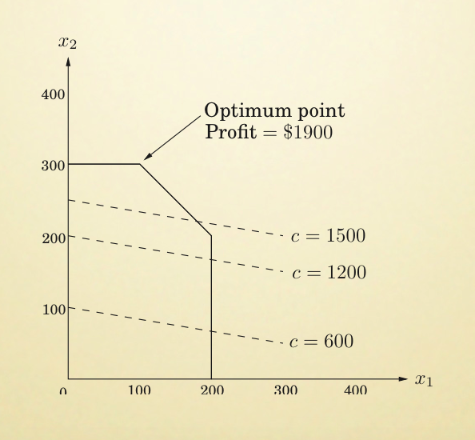
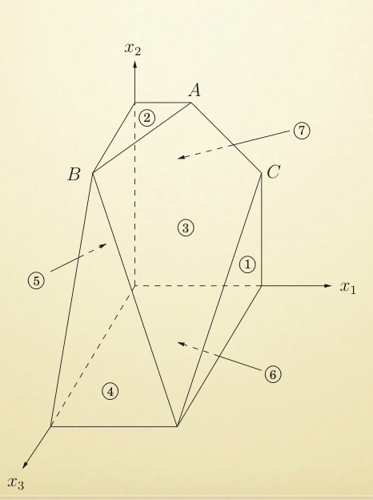

# Lecture 3

> LI Guoqiang's

今日话题：线性规划。

## Linear Programming

### Definition

* 给出一组变元
* 他们之间要满足一系列线性的等式或不等式
* 求出一组真值指派
* 使得给出的线性目标函数取得最值

### Example

资本家问题。

一家商店售卖两种巧克力。

* 一种是廉价的 Pyramide 巧克力
	* 每盒利润 1 鎂。
* 另一种是奢华版 Pyramide Nuit ~~Xs Pro Max~~ 巧克力
	* 每盒利润 6 鎂。

但是，商店每天最多只能卖 200 盒 Pyramide 和 300 盒 Nuit。

并且，工厂每天只能生产 400 盒巧克力。

如何安排生产量呢？

简单地把上面的条件列成四个不等式：

* $0 \le x_1 \le 200$
* $0 \le x_2 \le 300$
* $0 \le x_1 + x_2 \le 400$

> 注意现实生活中的问题，通常隐含地有着范围。
>
> > 例如不能反客为主向客人买巧克力。

要求得到的是 $\max x_1 + 6x_2$。

这个例子当然很简单，画出 $x_1 - x_2$ 的线性规划图，是这样：

很显然，$c = x_1 + 6x_2$ 这条直线所对应的最大 Profit，应该落在 $(x_1, x_2) = (100, 300)$ 上；即生产最多的 Deluxé 巧克力。

被限制函数围起来的这个范围称为「可行域」。

可行域中，使得目标函数最大的那个点称为「最优点」。

### Solving

#### 2-Dimension

如何解出这个 Optimum Point，就是线性规划关心的问题。

对于线性规划问题（即限制函数和目标函数都是变元的线性组合时）来说，可以证明如果有最优点，那么**其一定出现在某个顶点中**。

> 采用这种表述的原因是…
>
> 1. 存在「某一条边上，所有点都是最优点」的可能。
>
> 2. 可能由于相互冲突的限制函数，导致线性规划不可满足。这时当然没有最优点。
> 3. 同样，还有可能因为限制太宽松，导致整个可行域无限——此时也不存在最优点。
>
> > 3) 这种情况在真实世界不会出现。

2) 情况叫做 Infeasible（不可满足）。

3) 情况叫做 Unbounded（无界）。

在不存在这两种情况的时候，我们可以安全地使用「Vertex 遍历」的方式来找出最优点。

这种方式是随机挑选出一个顶点开始，并且始终选择「目标函数递增最快」的边前进。直到最後到达一个无法再增加的位置，就是最优点了。

#### 3-Dimension

如果我们再引入一种新的巧克力，即变元增加到三个的话，为了找可行域我们就得画三维图：

同样地，判断顶点就够了。但是再往高维走就很困难了，不能通过「图」的形式直观表达。需要抽象了。

### Go Practical

实际上，有的时候 Optimum Point 并不一定能对应到结果。

例如，「工人雇佣问题」、「巧克力生产问题」，都要求最後得到的数字是自然数。不能是负数，也不能是分数。因此如果 Optimum Point 对应一个不可行点，就不能作为实际问题的结果。

> 如何找到最优的合理点——这个问题就很复杂了。被称为 Integer LP 的问题，即便是在在 NP 中，都是一个很困难的问题。

更极端的，还有可能在可行域中一个合理点都没有——即线性规划问题有解，但是整数线性规划（即实际问题）无解的情况。

### ILP: How Hard?

整数线性规划有多困难？

至少他不会比最短路径问题简单。

因为我们可以构造这样的 ILP：
$$
\begin{gather*}
\sum_{e \in \delta(S)} x_{e} \geq 1 \quad S \in \mathcal{S}\\
x_e \in \{0, 1\} \quad e \in E
\end{gather*}
$$
在这种条件下求 $\min \sum_{e \in E} w_e \times x_e$ 的一个整数线性规划问题。

> 其中 $\delta(S)$ 代表点集合 $S$ 和其补集合 $\overline{S}$ 之间的边。

即，如果我们有多项式时间内解 ILP 的算法，那么也就能在多项式时间内得到最短路径（$x_e$ 取 $1$ 代表此边位于最短路径中，取 $0$ 代表不在）。

## Duality

> ILP 和解丢番图方程一样，都是很高深的问题。
>
> 这里回到一般的 LP。

### Intro

回到我们的产品计划问题。例如，针对
$$
\begin{gather*}
\max x_1 + 6x_2\\
x_1 \le 200\\
x_2 \le 300\\
x_1 + x_2 \le 400\\
x_1, x_2, x_3 \ge 0
\end{gather*}
$$
这个线性规划，容易解除他的解是 $(x_1, x_2) = (100, 300)$ 时的 $1900$。

但是，我们有什么办法能够验证这个结果吗？